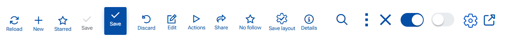
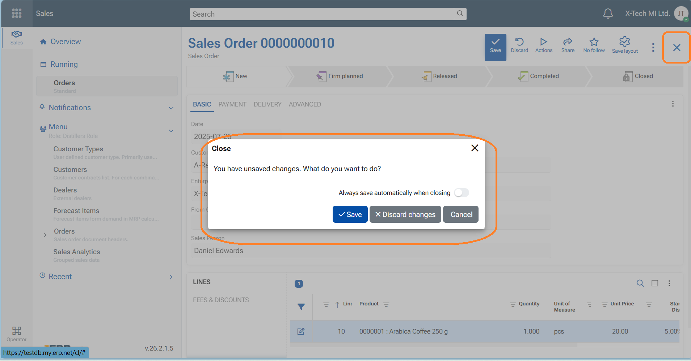
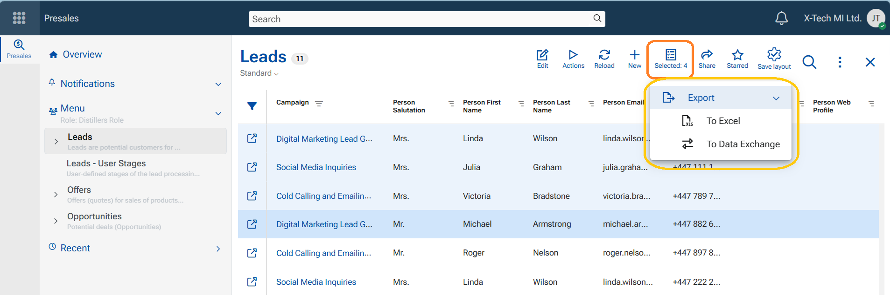
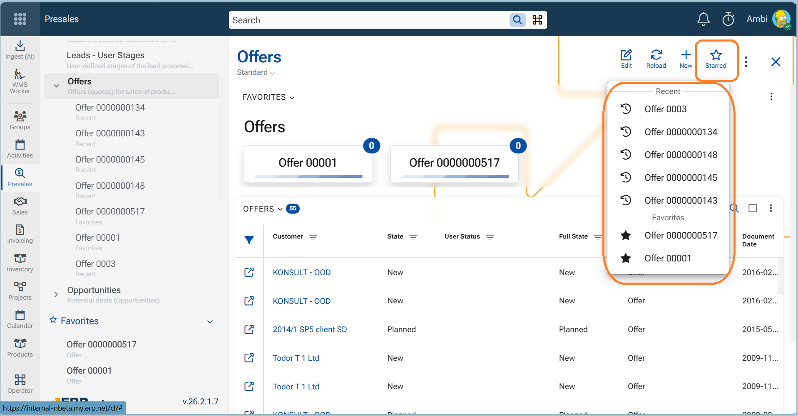

# Command Buttons
Buttons are available throughout the platform—on the top ribbon, inside panels, and in the navigation panel. They are accompanied by text (which can be hidden) and a hint that indicates what will happen when they are pressed.

In our platform, we use icons and toggle switches as buttons. In this section, we will explain the most common buttons found on the top ribbon of a record or navigator.

## Save
Use when you want to store your changes and continue working in the same form.

**Steps:**
1. Open a record (new or existing).
2. Make your changes.
3. Click **Save**.

**Result:**
- The changes are saved to the database.
- The form remains open.
- If there are **no changes**, **Save** is disabled (grey).
- If **validation fails**, the save is aborted and validation messages are shown.
---
## Save and Close & Save and Reload   

These appear in a record that is opened as a sub-form (opened through another form). "Save and Close" is the primary action.

- Use **Save & Reload** when you want to save your changes and refresh the form data and stay in the form. This will save and reload the form.
- Use **Save & Close** when you want to save your changes and exit the form. This will save data and close the form returning you to the starting form (e.g. another form or the navigator).

---
## Close (X)

Use when you want to exit the form without explicitly saving.

**1: If No changes are made or changes are saved**
1. Click **X**.
2. The form closes immediately.

**2: Unsaved changes exist**
1. Click **X**.
2. A confirmation dialog appears with the following options:
   - **Save changes**
   - **Discard changes**
   - **Cancel**
   - **Always save automatically when closing** - toggle switch ON/OFF

**Explanation of the options**
- "Save changes" -  Saves the changes and then closes the form.
- "Discard changes" - Closes the form **without saving** the changes. The user returns to the navigator form, or the starting form)
- "Cancel" - Keeps the form open so you can continue editing.
- "Always save automatically when closing" - This is a configuration key under [#71 /AlwaysSaveOnClose](https://docs.erp.net/tech/reference/config-options-reference.html#71-webclientalwayssaveonclose) 

> [!Note]
> 1. When enabled, this option is saved as a user preference, which means that when closing the form with **X** will automatically save changes without showing the dialog and without the need to explicitly press "Save" before that.
> 2. The configuration can be swithed ON/OFF from Main menu/Customize form/Settings tab.

---

## Discard

Use when you want to return to **view mode** of the form without saving your changes.

**Steps**
1. Click "Discard"
2. The unsaved changes are lost
3. The form gets back to view mode (exit edit mode)

---

## Toggle switch

Use to switch ON or switch OFF features. You can find it in the app-bar menu, in notifications settings, in notifications options, show elements (fields) in a form, etc.
- ON - toggle is "blue", switch goes to the right
- OFF - toggle is "grey", switch goes to the left

---

## Edit

Use when you want to make changes to the data in a form, in a navigator (e.g. add/remove rows, create a new record directly in the navigator, paste rows, etc.), in a line-panel (panel with lines/rows, e.g. add new line), edit a file etc. Only editable records have this button available in the top ribbon.

- to enter Edit mode, press the blue button "Edit". The button disappears and is replaced by the "Save" button
- to exit Edit mode - save changes, or discard changes

> [!Note]
> Will not appear if the Document (Record) is at Released state, because no edits are allowed then.

---

## New (+)

Use to create a new record. It is available in the navigators, the navigation panel, or in header of a Related data panel (+ New). 
  When pressed the platforms opens a blank Single record Form to be filled in with the new data.
> [!IMPORTANT]
> Do not confuse with button "+ Create new" in line-panels. It creates a new line and is preliminary used to create a new record under specific conditions e.g. related data or details data **that has its own form**.

---

## Reload
Use to refresh the page, equal to F5 key. It appears in the navigators.

---
## Details

Use to open a side panel "Details" with selected fields that describe the current record (e.g. Project, Assigned to User, Customer - any field that belongs to the definition of the object).

---
## Selected

Appears in the navigator immediately after a record (row) is focused. It indicates the number of selected records.The button has an indicative function—showing how many records are selected—and also serves as a gateway to the "Export to Excel" and "Export to Data Exchange" functions.

- When "Export to Excel" is executed, the selected records are converted into an automatically downloaded Excel file.
- When Export to Data Exchange is executed, the system creates a record in Exchange / Data Exchange, which is then executed at a specified time.

---
## Save layout

The sole function of this button is to save layout modifications so that the form is loaded as intended.

It appears in the session of a user who has permission to edit layouts (either Global Layout Manager permission or Layout Admin for the role). When a layout modification is made—whether to a form, a panel, or settings in the Advanced Filter panel—it becomes visible in navigators and single-record forms.

The button appears in two colors:

- Blue – indicates a minor modification, such as resizing or hiding a column in a navigator, sorting data, showing or closing a side panel, or adding or changing a filter in the Advanced Filter panel.
-  Red – indicates a major modification made via the Customize Form or Customize Panel menu options. This alerts the user that the button should be pressed.

If the user does not press the button, the layout modifications will not be saved for the role, and the form will not be delivered according to the latest customizations. For this reason, this button is essential for platform administration and workspace consistency.

---

## Starred

This button is visible in navigators. When clicked, it reveals a list of max 5 **Recent** and max 15 **Favorite** records for the currently observed entity type. For example, if a user opens the Offers navigator, the Starred button displays recent and favorite offers. Clicking a listed item opens the corresponding record.

---

## Follow

No follow, Tagged, Following Favorite

---

## Share

---

## Actions

---

## Gearwheel

---

## Zoom lens

---

## Three wertical dots

---

## Square & arrow

