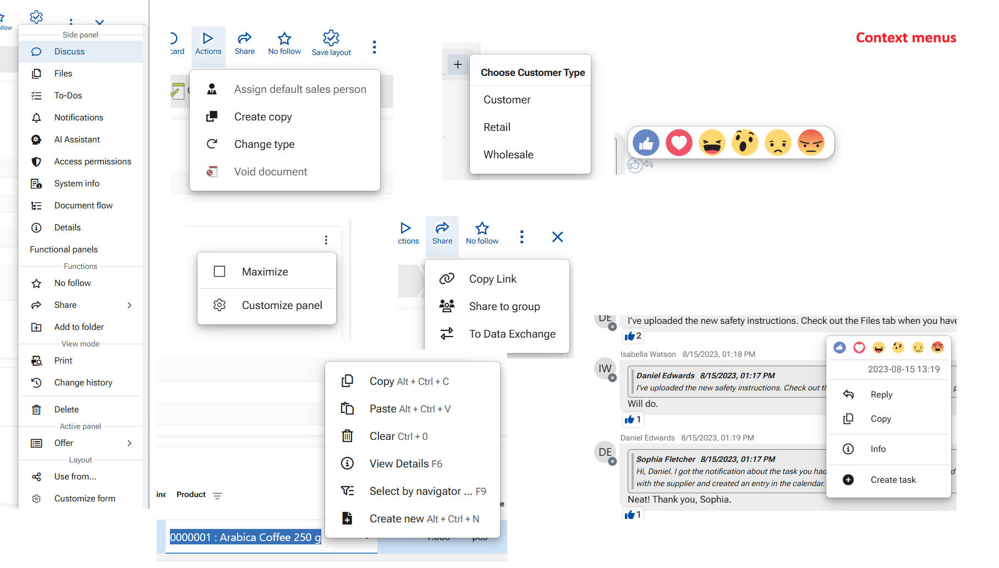

# Command Tools in @@webclient 

These consist of Command buttons and Context menus. This section will explain each command button and context menu features in details — its purpose, behavior, and expected results when clicked. 

## Command buttons

An essential part of the ERP.net Web Client interface. They perform actions ranging from saving and closing entries to initiating processes, navigating between views, and interacting with documents and data. These buttons are typically displayed at the top of panels and forms, or in the context menus, providing direct access to frequently used commands and functionalities.

Each command button consists of a text and a symbol that visually reinforces its purpose, helping users understand its function at a glance. Symbols (icons) are so carefully selected, so that the button actually becomes a sign and even the text can be omitted (not shown) because thus it intuitively represent the action performed.

All command buttons also include helpful tooltips that appear when hovered over, providing users with clear hints about the button’s function before clicking.

While some command buttons are standardized across the system (e.g., Save, Close, Delete, Print), and others are contextual and appear depending on the type of record or process being handled. 

## Context menus

Context menus vary widely depending on the element, feature, or field they serve. They contain operations specific to the panel, form, field, or feature currently in use. Context menus may also be attached to buttons—for example, the Run button includes a context menu with multiple functions.

These menus are indicated either by a three-dots icon or a down-arrow on the button itself, or they can be revealed by right-clicking on an element (for example, a field or a comment).

