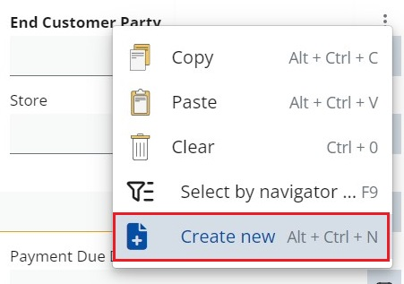
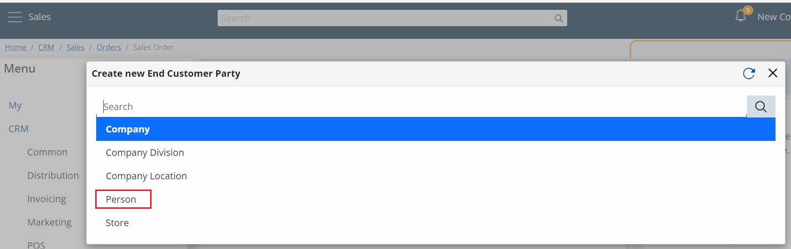

# How to use the Create New option

The **Create New** option allows you to easily create a value for a certain field. It opens a new form, where you can create a new item, then the system returns to the main form with the created record filled in.

## Example:

1.	Create new Sales Order

2.	Click into the End Customer Party field and a three-point button of the context menu will appear.

3.	By clicking on it, you expand a menu where you can choose Create New option.

4.	Select the type of the object (if it is necessary) and the respective form for the field type opens up and allows a record creation.

5.	The new form appears in the breadcrumb as a subitem of the current.

6.	Click the Save button and the system returns to the main form with the created record filled in.

