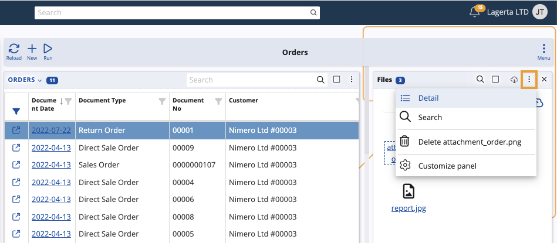
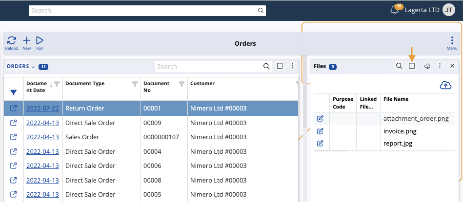
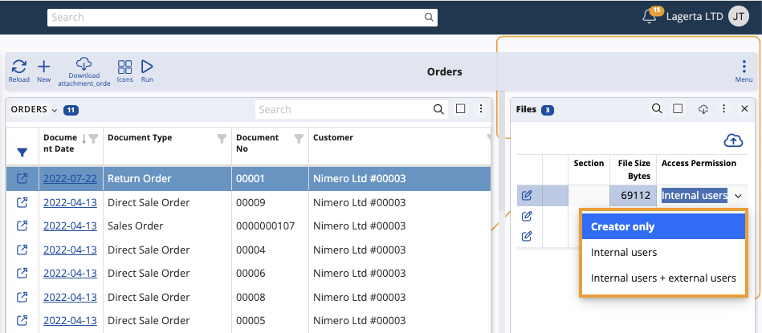

# How to use the Access Permission field

The **Access Permission** field determines what files each user can view, modify, or manage within the ERP system.

### Step-by-step process

Each document type (such as sales orders or invoices) features a **Files** side panel.

Select a document and click to open.

If you want to see the side panel you need to expand the **Three-dot button** from the Menu button and select the **Files** panel.

When you click on a document, the side panel will show you if there are attached files.
 
To choose who can see the files attached to a document, you can use the **Detail** option.

It may be more convenient to maximize your page, use the **Square button**.

The **Access Permission** field allows you to select the drop down menu to choose from three types of visibility: 

**Creators only** - the files are visible only to the person who attached them.
**Internal users** - the files are accessible exclusively to internal users. 
**Internal users + external users** - the files are visible to everyone, including external users.

 
Once you modify this field, your changes will be applied instantly.
