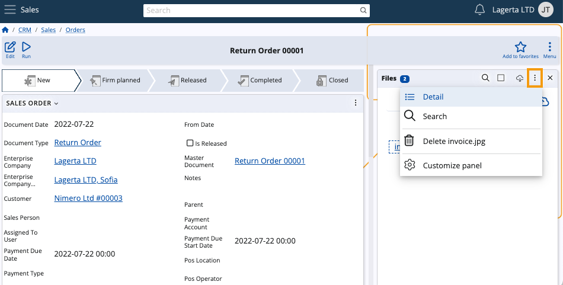

# How to use the Access Permission field in the Files panel

There's a way to individually control each document attachment’s accessibility by enforcing one of three access permission rules. 

This way, you can limit an attachment's visiblity to just the person who uploaded it, all internal users, or both internal and external (e.g. Client Center) users.

### Step-by-step process

1. From the **Files** panel of a document, click on the three-dot button and select the **Detail** option.

   This allows you to expand settings for each uploaded attachment.

   

2. Within the **Detail** settings, locate the **Access Permission** field and expand its dropdown menu.

   The following rules can be enforced:

   * **Creators only** - the file will be visible to the person who uploaded it as well as to administrators
   * **Internal users** - the file will be visible to all internal users
   * **Internal users + external users** - the file will be visible to all internal and external users.

> [!TIP]
> Click the **Square button** of the **Files** panel to use it in full-screen mode.

   
 
Once you modify the **Access Permission** field of a document attachment, your changes will take effect instantly.
