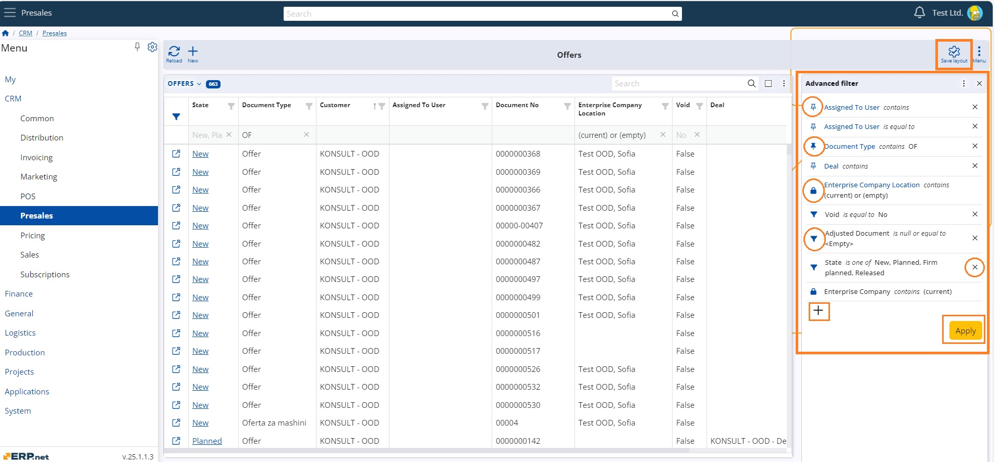
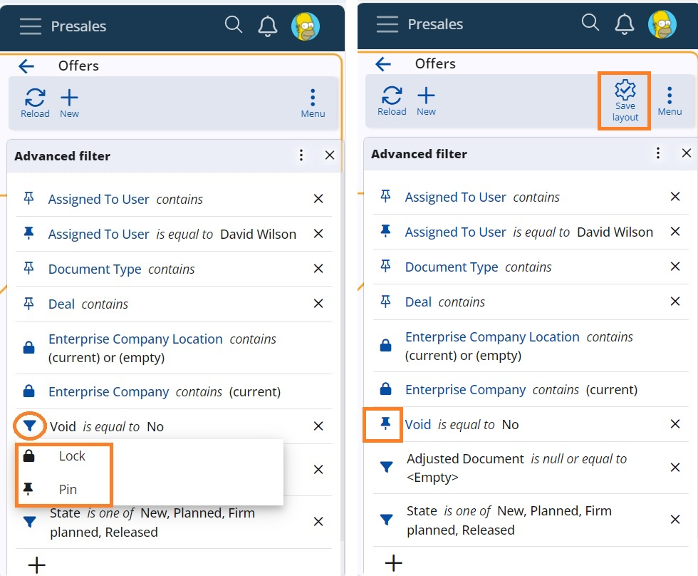
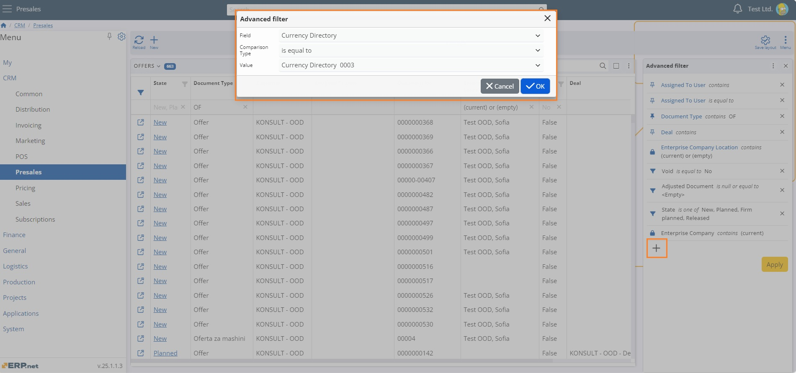
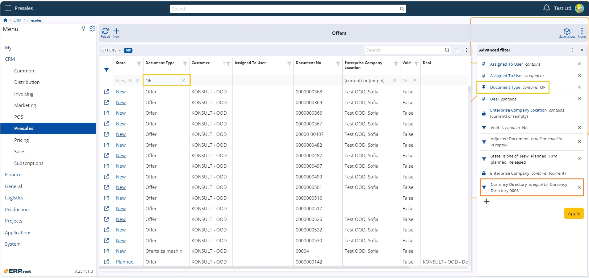
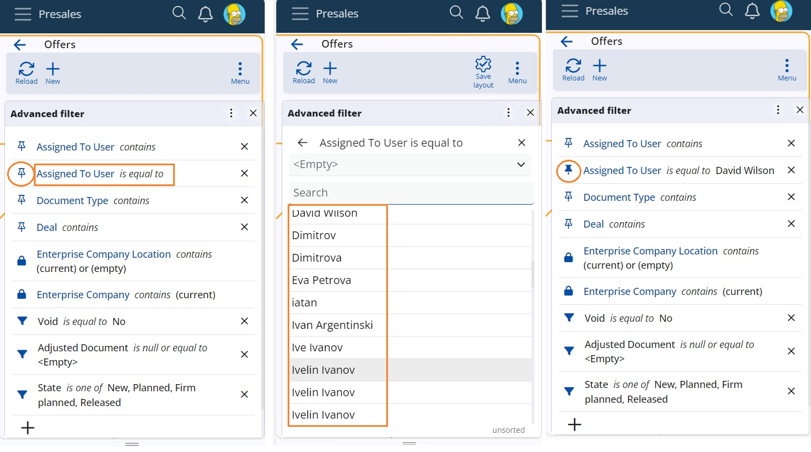
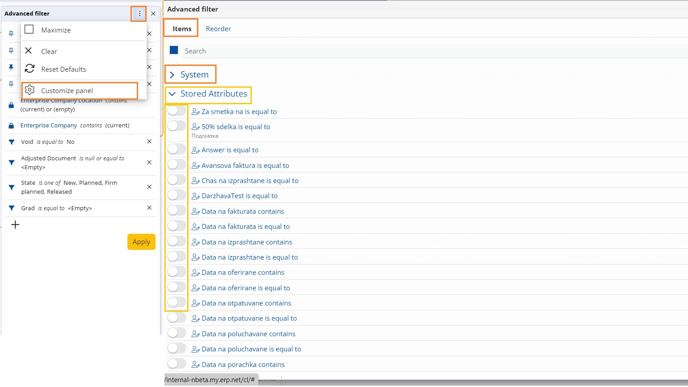
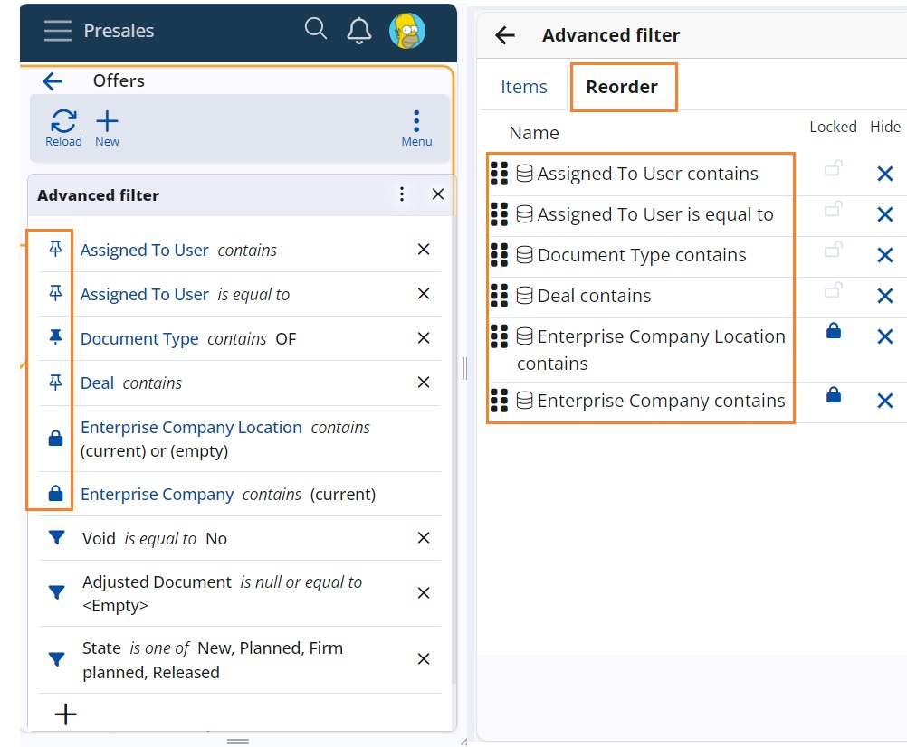

# How to use Advanced filter 

**Advanced filter** panel is a side panel, that serves for extraction of data in a navigator.
Upon opening it, the panel displays default combinations of filter fields + comparison types (+ values) that apply to the current navigator.
Following are the main elements and mode of exploitation of the Advanced filter in WEB.

## Three types of filters
Filters are distinguished by the accompanying icon and colour:

• Common (dynamic) – а filling funnel – it is recognized as such when added with the **+** button, through the filtering row or an URL is opened;
• Pinned – a pin – always active, when you pin a common filter or when it is added through the Customize panel section;
• Locked – a locker – when you lock a common or pinned filter. It is always active and accessible only by admins.

## Colours
A contour filter icon denotes lack of value. A solid colour filter icon denotes presence of value.
Pinned and locked filters also change field name font colour to blue.
> [!NOTE]
> 
><Empty> IS a value.

## Apply
When you supply а value to the filter the Apply button lights in orange colour and executes the filtering.

## Save layout
The button activates when a significant change to filters is done. Clicking on the filter icon calls the options pin/unpin and lock/unlock to manage the type. Now you have saved the set filters in the panel.

## How to add a filter?
There are several ways to add a filter:
1. By clicking on the + button (add a common filter)

A window "Advanced filter" pops-up. There you choose the field from a list, the comparison type and the value. Confirmation with the Enter key leads to the next fieled, until you reach the final OK button. All attributes are chooseable.

> [!NOTE]
> 
> Calculated attributes do not support filtering.

2. Through the navigation row (add a common filter).

When you insert a value in a column in the navigation row, the parameters are automatically added to the Advanced filter set.

> [!NOTE]
> 
> Filtering by the row is supported only for attributes that have the comparison type “contains”.

3. Through a URL – the filter combinations of the address are loaded in the panel.
4. Through the Customize panel  - (add a pinned valueless filter)
Switch on predefined combinations of filter fields + comparison types e.g. *Assigned to User is equal to, Assigned to User is one of, Assigned to User contains* etc. 

## How to edit a filter?
Only modification of values is possible. A click in the filter opens the value field to alter or add value. It might insert valuese, choose from a list of values and for date fields select from a calendar.

## How to delete a filter?
Use the X button next to the filter to completely delete a common filter and to clear the value of a pinned filter.
Locked filters cannot be altered.

## Customize panel
This completely new concept targets the tasks of administrators and consultants to adjust well in advance the desired filters and layout of the panel.

Tab Items consists of all possible combinations of attributes (system and stored) plus supported comparison types e.g. *Deal contains, Deal is one of, Currency directory is equal to, Currency directory contains…*
Advanced users switch on the filters that adds non-value pinned filters in the panel. Users then tune them with the value.

Tab Reorder contains all pinned and locked filters for further rearrangement or deletion.

> [!NOTE]
> 
> The screenshots taken for this article are from v.25 of the platform.
