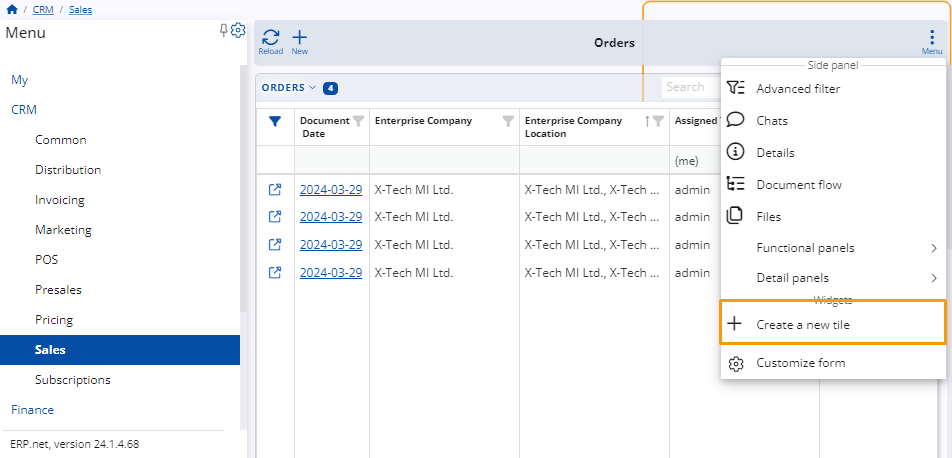

# How to filter by (me), (current), and (empty)
 
You can use filtering expressions for applicable attributes to narrow down the scope of what is displayed in a particular navigator.
 
They are specified in the **filter row** found under some columns of the respective navigator as well as in the **Advanced filter** panel using the **contains** operator.
 
If the filtering row is not visible, you can **enable** it through the panel's menu or by clicking on the **filter icon** on the far-left of the columns.

**Example:**

Within the Orders panel of the Sales module, you input "**(me)**" in the filtering row of the **Assigned To User** column.

This results in only items **assigned to you** to be displayed in the table.
 
_29_03.png)
 
## Rules and syntax
 
Filtering expressions follow a fixed syntax that can influence the outcome they produce.

It's therefore crucial to write them down exactly as they are if you want to achieve the desired effect.
 
### (current) and (empty)

This functionality enables you to conveniently locate items associated with your company and its location.

You can employ the filtering expressions "(current)" and "(empty)" to achieve this. 

When using "(current)", the table will display either your company or your current role, depending on the column where you enter the expression. 

On the other hand, "(empty)" will reveal cells with no values.

**Example:**

Input **"(current)"** into the filtering row of the **Enterprise Company** column. 

Only items associated with the company you're currently involved with will be displayed in the table.
 
 _29_03.png)
 
You can also assign more than one filtering expression at a time. To do that assign them with different columns or combine them in one with “or”.

**Example:**

In the **Orders** panel of the Sales module, you aim to locate all orders belonging to your company and assigned to you. 

You want to ensure that each order has a location assigned. To accomplish this, input "(current)" in the Enterprise Company column to filter items linked to your company. 

In the **Assigned to User** column, input "(me)" to narrow down orders assigned specifically to you. 

For the **Enterprise Company Location**, input "(current) or (empty)" to display both items with a location and those without. 

This ensures comprehensive visibility of orders while verifying that each order has an assigned Enterprise Company location.
 

 
> [!NOTE]
> 
> When you input expressions in the filtering row, popup suggestions will appear beneath the cell.

## Use tiles with filtering expressions

Once you've set a filtering expression, you can generate a **tile** via the page menu. Upon tile creation, the expression becomes permanently linked to it.

**Example:**

Filter the table to show only items assigned to you, then, open the page menu and click on the **Create a new tile**.
 

Once you’ve done that a window will open where you can give that tile a name. In this case, it will be “Orders assigned to me”.

 
When you are ready click **OK** and the tile will be ready.
 

