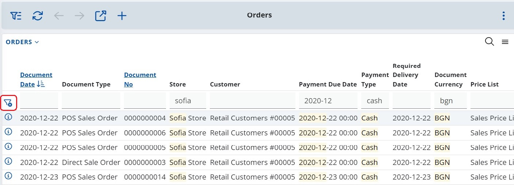

# How to use Filter row in navigators

By using the filter row in navigators, it is possible to filter records by setting values in almost all kind of fields, including text, true/false and date.

The filter row can be expanded and collapsed on-demand using the respective filter button. Specific values can be set for multiple fields at a time. The more rules you set, the more precise the final filtering on the page will be.

Sorting is possible for the fields that support it, by clicking in the field header.

