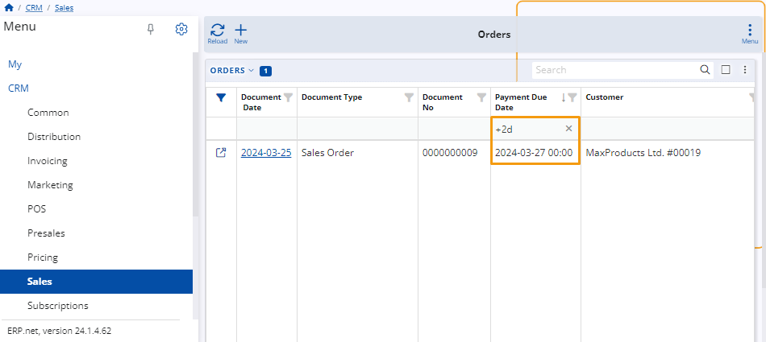

# How to use period expressions 

You can use period expressions to narrow down the scope of what is displayed in a particular navigator.

They are specified in the **filter row** found under the column that displays the data you want to limit.

If filtering rows are not visible, you can **enable** them through the respective panel's menu.

**Example:**

Within the **Orders** panel of the **Sales** module, you input "(today)" in the filtering row of the **Document date** column.

This results in only items created on the current day to be displayed in the table.

## Rules and syntax

Filtering expressions have constraints and their syntax can influence the final result. 

It's crucial to ensure their proper formulation to achieve desired results. 

### Relative time expressions 

These expressions refer to time periods relative to the current moment, rather than specifying exact dates. Examples include (yesterday) or (last month). These expressions, enclosed within brackets, are used to define time periods relative to the current date without specifying specific dates.

### Relative date expressions

These expressions refer to specific dates relative to the current date. For example, "-7d" denotes a date seven days before the current date, while "+2d" represents a date two days ahead of the current date. These expressions, written without brackets, are used to specify exact points in time relative to the present moment.

### Relative period expressions 

These expressions refer to specific periods relative to the current date. For example, (-1m) denotes the month that was before the current month, while (+2m) represents the month that is ahead of the current month. Enclosed within brackets, these expressions are used to specify time periods relative to the present moment.

#### Expressions for large relative time periods

These expressions establish time periods relative to specific intervals or divisions within a broader timeframe. For example, "q1," "q2," and "h1" mark these periods. "q1" signifies the first quarter of the year, "q2" represents the second quarter, and "h1" denotes the first half of the year.

 

#### Assign custom time periods

Custom time periods can be designated, for instance, (feb)..(today) representing the timeframe spanning from month February up to and including today. (yesterday) specifically denotes yesterday's date. Additionally, (yesterday)..+2d extends from yesterday to two days ahead, ensuring a comprehensive scope within your data analysis.

> [!NOTE]
> - Zero without brackets represents today as both the beginning and end of the period.
> - If no dimension is specified, the default dimension is days: "-7" is equivalent to "-7d" and "0" represents today.
> - When specifying a period in days, it can be written with or without brackets.

> [!NOTE]
> 
> The screenshots taken for this article are from v24 of the platform.
