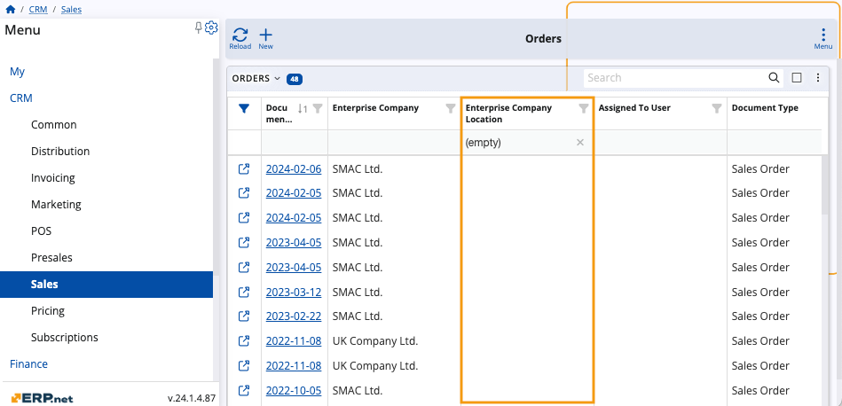
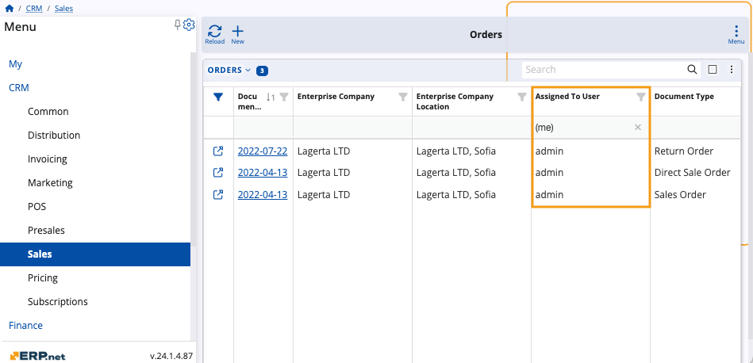
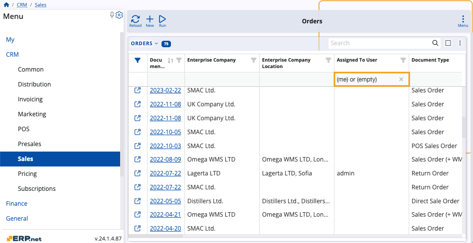
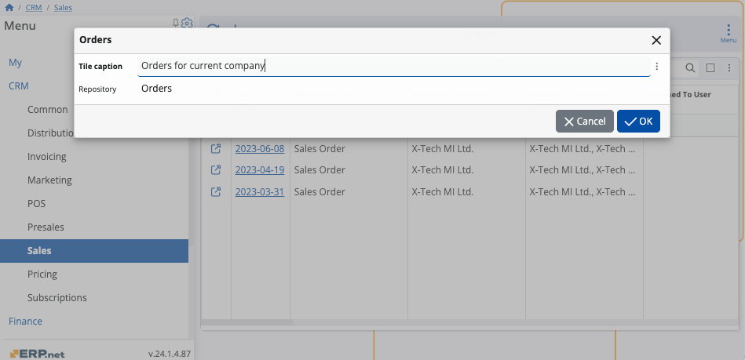
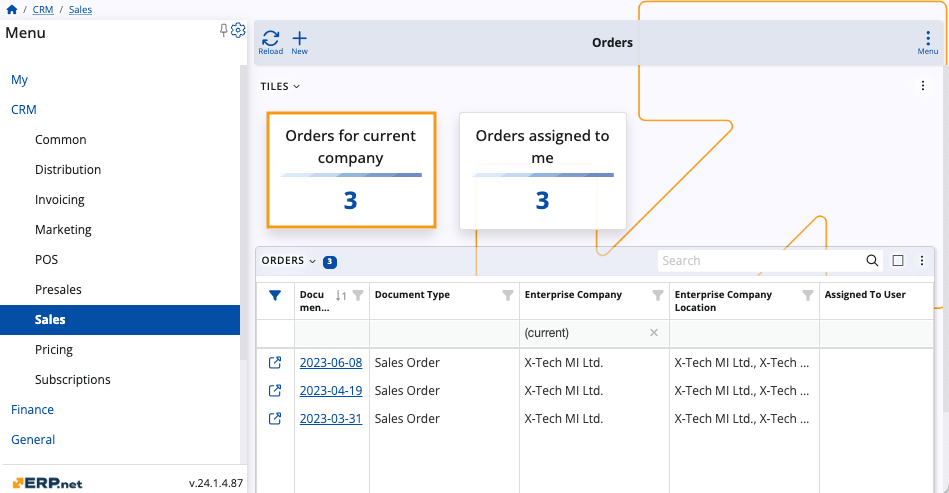

# How to filter by (me), (current), and (empty)
 
You can use filtering expressions for applicable attributes to narrow down the scope of what is displayed in a particular navigator.
 
They are specified in the **filter row** found under some columns of the respective navigator as well as in the **Advanced filter** panel using the **contains** operator.
 
If the filtering row is not visible, you can **enable** it through the panel's menu or by clicking on the **filter icon** on the far-left of the columns.

**Example:**

Within the **Orders** panel of the **Sales** module, you input "**(me)**" in the filtering row of the **Assigned To User** column.

This results in only documents **assigned to you** to be displayed in the table.
 
_29_03.png)
 
## Rules and syntax
 
Filtering expressions follow a fixed syntax that can influence the outcome they produce.

It's therefore crucial to write them down exactly as they are if you want to achieve the desired effect.

> [!NOTE]
> 
> You can apply **more than one** filtering expressions at a time.    This way, your navigator could visualize items that are related to your current user and also associated with your current enterprise company and its location. 
 
### (current)

This expression enables you to conveniently locate documents related to your current enterprise company, its location, or a role.

**Example:**

Input **"(current)"** into the filtering row of the **Enterprise Company** column. 

Only items associated with the company you're currently logged in with, will be displayed in the table.
 
_29_03.png)

### (empty)

This expression can be inserted into all fields that support the "equals" and "contains" operators.

It works as a **Null** filter, making a navigator reveal items that **do not** contain data for the column in which (empty) is applied.

**Example:**

Input **"(empty)"** into the filtering row of the **Enterprise Company Location** column. 

Only items that do not have an enterprise company location will be displayed in the table.

### (me)

This expression enables you to locate only the documents related to the user you are currently logged in as, eliminating the need to search for your own username in a field's dropdown list.

It can be applied to all fields referring to the **[Systems.Security.Users Entity](https://docs.erp.net/model/entities/Systems.Security.Users.html)**.

**Example:**

Input **"(me)"** into the filtering row of the **Assigned To User** column. 

Only items assigned to the user you're logged in as will be displayed in the table.

 
> [!NOTE]
> 
> When you input expressions in filtering rows, **popup suggestions** will appear to speed up the writing process.

### (me) or (empty)

It's possible to apply the (me) and (empty) expressions separated by an "or" operator in the same filtering row.

As a result, the navigator will display items that meet either of these conditions.

**Example:**

Input **"(me) or (empty)"** into the filtering row of the **Assigned To User** column. 

Unassigned items **as well as** items assigned to the user you're logged in as will be displayed in the table.

### (current) or (empty)

Similarly, you can apply the (current) and (empty) expressions within the same filtering row, again separated by an "or" operator.

**Example:**

Input **"(current) or (empty)"** into the filtering row of the **Enterprise Company Location** column. 

Items not related to an enterprise company location **as well as** those associated with the current one will be displayed in the table.

## Using tiles with filtering expressions

When you apply one or more expressions to a navigator, you can create a **[tile](https://docs.erp.net/webclient/introduction/my-apps/tiles.html)** for it in order to save its current filtering configuration.

> [!NOTE]
> 
> If you access a filtered navigator through a tile, data will always be adjusted to match that of the respective logged in user, their current company and location, or the role they are assigned at the moment.   
> When a navigator filtered by (me) is accessed through a tile, for instance, it will always display records relevant to the currently logged-in user.

**Example:**

Filter a sales order navigator to display only the documents related to the current enterprise company. 

Then, create a tile for it, naming it “Orders for current company”.
 

 
When you save your tile, you will be able to access it from within the **Tiles** app in the **My** module, or directly from the respective navigator if it's integrated as a panel.
 

