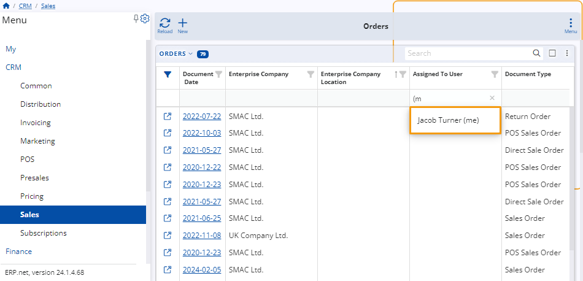
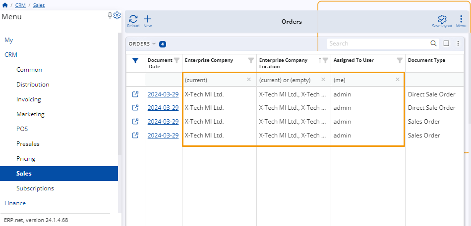
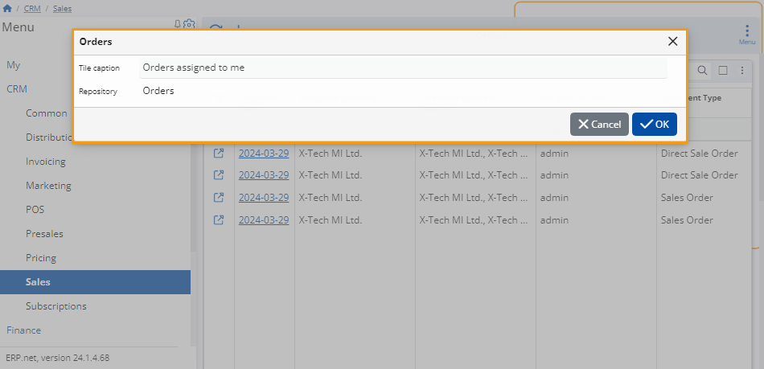
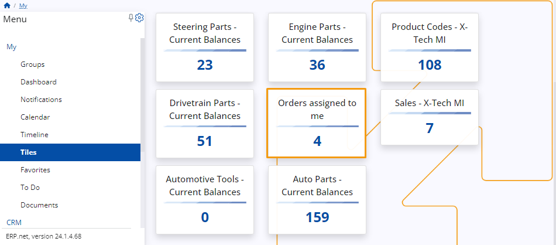

# How to filter by (me), (current), and (empty)
 
You can use filtering expressions for applicable attributes to narrow down the scope of what is displayed in a particular navigator.
 
They are specified in the **filter row** found under some columns of the respective navigator as well as in the **Advanced filter** panel using the **contains** operator.
 
If the filtering row is not visible, you can **enable** it through the panel's menu or by clicking on the **filter icon** on the far-left of the columns.

**Example:**

Within the **Orders** panel of the **Sales** module, you input "**(me)**" in the filtering row of the **Assigned To User** column.

This results in only documents **assigned to you** to be displayed in the table.
 
_29_03.png)
 
## Rules and syntax
 
Filtering expressions follow a fixed syntax that can influence the outcome they produce.

It's therefore crucial to write them down exactly as they are and in the correct filtering rows if you want to achieve the desired effect.

> [!NOTE]
> 
> You can apply **more than one** filtering expressions at a time.    This way, your navigator could visualize items that are relevant to the current user and also match the current enterprise company and its location. 
 
### (current)

This expressions enables you to conveniently locate documents associated with your **enterprise company** and its **location**.

* **(current)** makes the table display only the items linked to the enterprise company and/or location you're currently logged into.

**Example:**

Input **"(current)"** into the filtering row of the **Enterprise Company** column. 

Only items associated with the company you're currently involved with will be displayed in the table.
 
_29_03.png)

### (empty)

This expression can be inserted into all fields that support the "equals" and "contains" operators.

It works as a "Null" filter, making a navigator reveal items that are not strictly tied to any enterprise company and/or location.

### (me)

This expression enables you to locate only the documents relevant to the user you are currently logged in as.

It can be applied to all fields referring to the **[Systems.Security.Users Entity](https://docs.erp.net/model/entities/Systems.Security.Users.html)**.

(me) eliminates the need to search for your own username in a field's dropdown list.

When a navigator filtered by (me) is accessed through a **tile**, it will automatically display records relevant to the currently logged-in user.

**Example:**

Input **"(me)"** into the filtering row of the **Assigned To User** column. 

Only items assigned to the user you're logged in as will be displayed in the table.
 
> [!NOTE]
> 
> When you input expressions in filtering rows, **popup suggestions** will appear to speed up the writing process.

### Multiple filtering expressions

It's also possible to place multiple expressions within the same filtering row with the “**or**” operator. As a result, the table will display items that meet all of these conditions.

## Using tiles with filtering expressions

When you apply one or more expressions to a navigator, you can create a **[tile](https://docs.erp.net/webclient/introduction/my-apps/tiles.html)** for it in order to save its current filtering configuration.

**Example:**

Filter a navigator to display only the items assigned to you. Then, create a tile for it, naming it “Orders assigned to me”.
 

 
When you save your tile, you will be able to access it from within the **Tiles** app in the **My** module.
 

