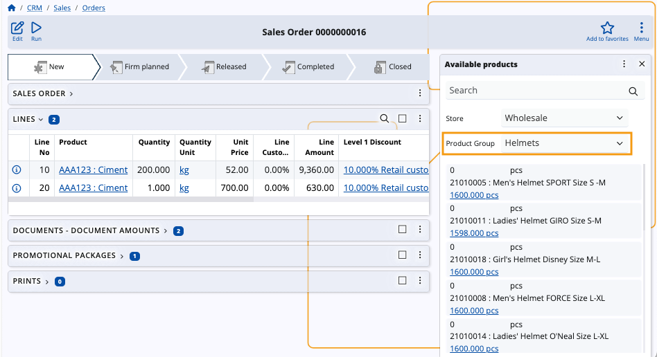
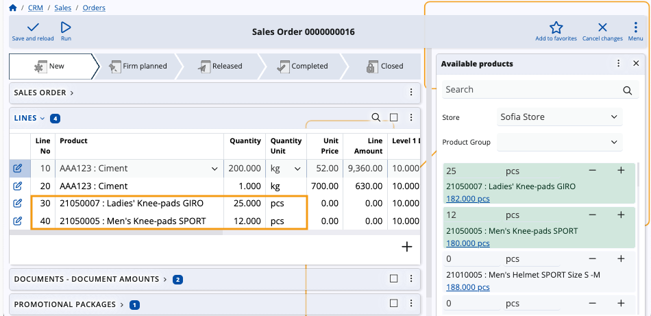

# How to use the Available products panel

The **Available products** functional panel displays a list of products which are currently in stock for a respective **store**.

Using it, you can easily **adjust** existing product quantities or **add** new ones in the document lines of logistical documents.

### Navigation

To reveal the panel, you need to open the document form of a sales order, a purchase order, or another logistical document.

Then, choose **Available products** from the list of **Functional panels** found within the **Menu** button.

> [!NOTE]
> The panel's buttons will be visible and usable only when you:
> * **create** a new document
> * **edit** an existing document

## Panel features

The **Available products** panel includes a **search bar** and an option to **filter** products by groups.

You can enter **quantities** manually, adjust them with **“+”** and **“-”** buttons, as well as determine their **measurement units**.

> [!WARNING]
> Available products will be loaded only for a selected **store**. Wihout a store selected, the panel will be **empty**.

### Filter by product group

For convenience, you can filter products available for a store by choosing the **product group** to which they belong.

Simply expand the **Product Group** dropdown menu from the **Available products** panel and select the desired group.

Once selected, only products from the chosen group will appear in the list.

### Add and remove quantities

The **Available products** panel offers the ability to **add** or **remove** product quantities in the lines of the respective document. 

To do so, you need to be **creating** or **editing** that document.

Then, use the “+” and “-” buttons to increase or decrease quantities as needed.

Newly added product quantities are automatically added as new rows in the **Lines** panel of the respective document.

> [!NOTE]
> The screenshots taken for this article are from v24 of the Web Client.
