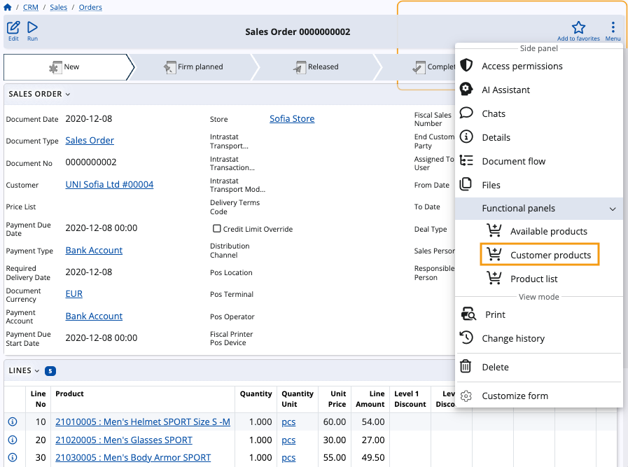
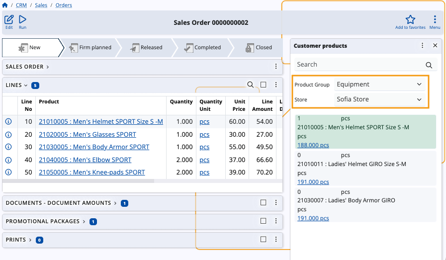
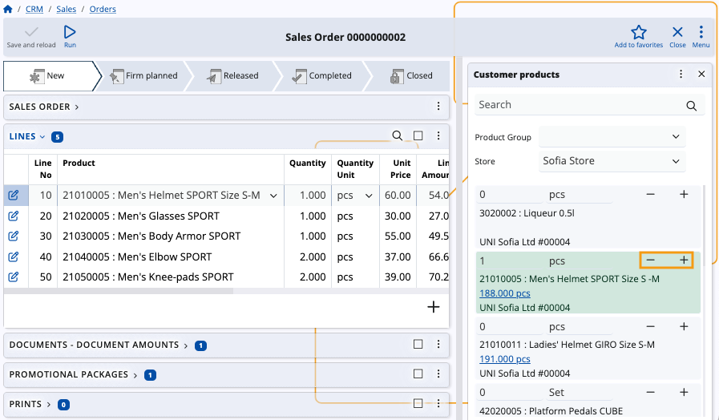
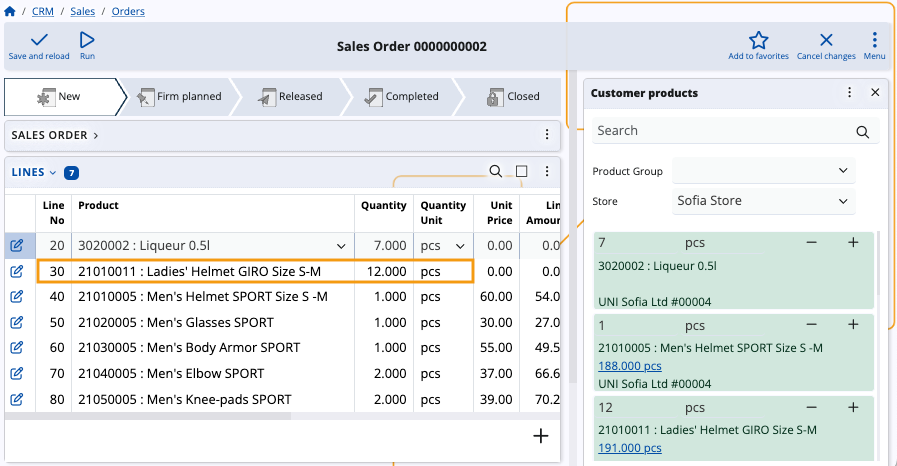
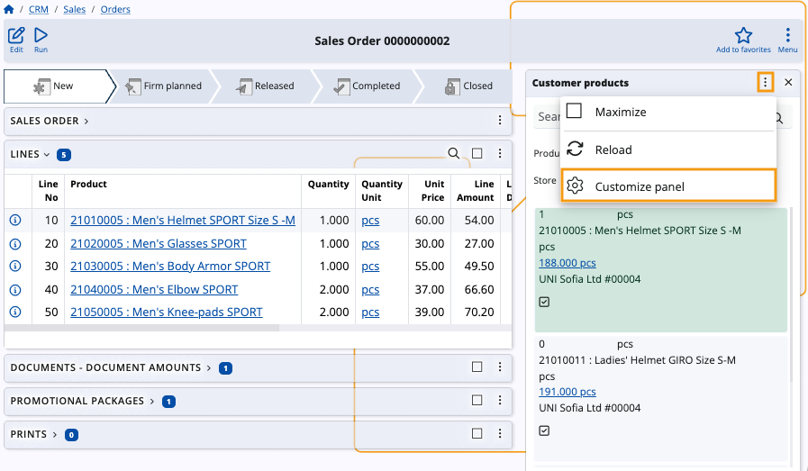

# How to use the Customer products panel

The **Customer products** functional panel displays a list of products which are negotiated for a particular **customer**.

Using it, you can easily **adjust** existing product quantities or **add** new ones in the document lines of logistical documents that have a **customer** as part of their definitions.

### Navigation

To reveal the panel, you need to open the form of a document which has an active **Customer** field (e.g. a sales order).

Then, choose **Customer products** from the list of **Functional panels** found within the **Menu** button.

> [!NOTE]
> The panel's buttons will be visible and usable only when you:
> * **create** a new document
> * **edit** an existing document

## Panel features

The **Customer products** panel includes a **search bar** and an option to **filter** products by groups and stores.

You can enter **quantities** manually, adjust them with **“+”** and **“-”** buttons, as well as determine their **measurement units**.

> [!WARNING]
> Customer products are loaded for a selected **store**. Changing the store will also change the products being displayed.

### Filter by store and product group

You can filter customer products by choosing the **product group** to which they belong, as well as the **store** they are available in.

This can narrow down the products, offering a more filtered view of the panel.

### Add and remove quantities

The **Customer products** panel offers the ability to **add** or **remove**  product quantities in the lines of the respective document. 

To do so, you need to be **creating** or **editing** that document.

Then, use the “+” and “-” buttons to increase or decrease quantities as needed.

Newly added customer product quantities are automatically added as new rows in the **Lines** panel.

### Customize panel

If needed, you can **customize** the **Customer products** panel by showing or hiding certain fields for all products listed by the panel.

This includes all fields from the **[Crm_Customer_Products](https://docs.erp.net/model/tables/Crm_Customer_Products.html)** table and the **[Gen_Products](https://docs.erp.net/model/tables/Gen_Products.html)** table.

> [!NOTE]
> The screenshots taken for this article are from v24 of the Web Client.
