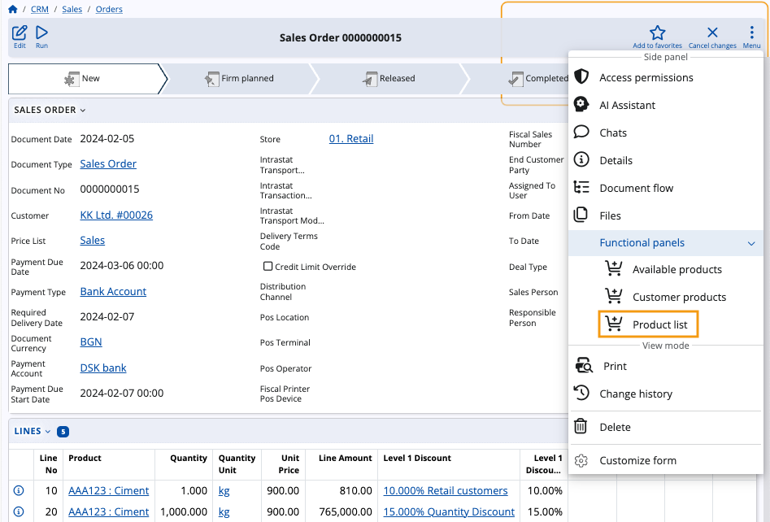
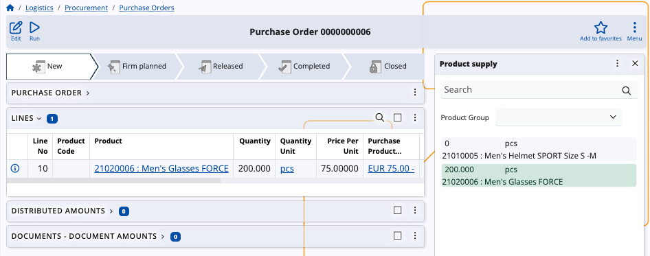
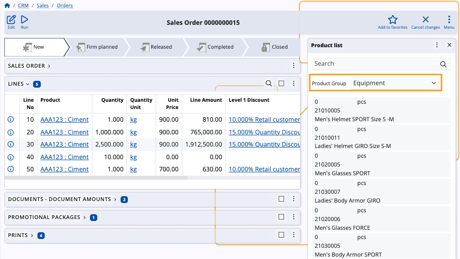
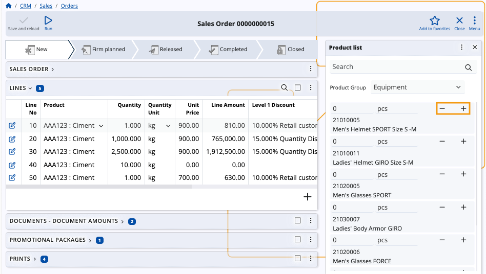
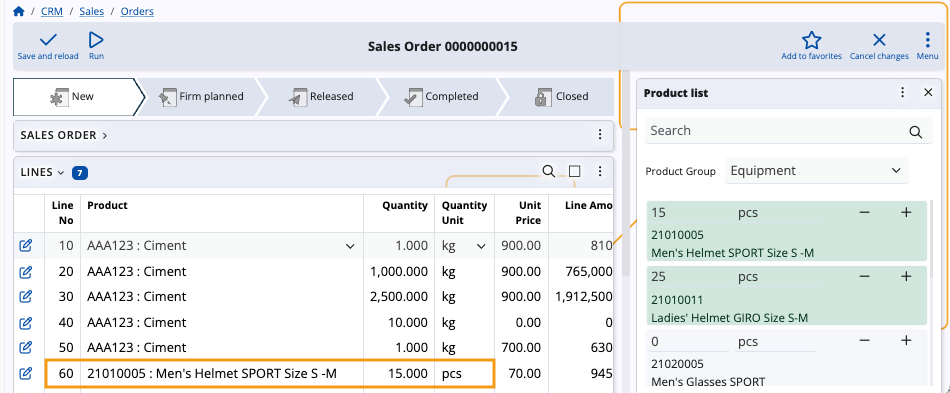

# How to use the Product list panel

The **Product list** functional panel displays all products belonging to an enterprise company, filtered by their unique product groups.

Using it, you can easily **add** or **remove** product quantities in the document lines of logistical documents.

### Navigation

To reveal the panel, you need to open the document form of a sales order, a purchase order, or another logistical document. Then, choose **Product list** from the list of **Functional panels** found within the **Menu** button.

> [!NOTE]
> The panel's buttons will be visible and usable only when you:
> * **create** a new document
> * **edit** an existing document

## Panel features

The **Product list** panel includes a **search bar** and an option to **filter** products by groups.

You can enter **quantities** manually, adjust them with **“+”** and **“-”** buttons, as well as determine their **measurement units**.

> [!WARNING]
> Products will be loaded only for a selected **group**. Without a group selected, the panel will be **empty**.

### Filter by product group

Once you select a group, only products belonging to it will appear in the list.

### Add and remove quantities

The **Product list** panel offers the ability to **add** or **remove** product quantities in the lines of the respective document. Use the dedicated **“+”** and **“-”** buttons to increase or decrease quantities as needed.

New product quantities are automatically added as new rows in the **Lines** panel of the respective document.

> [!NOTE]
> The screenshots taken for this article are from v24 of the Web Client.
