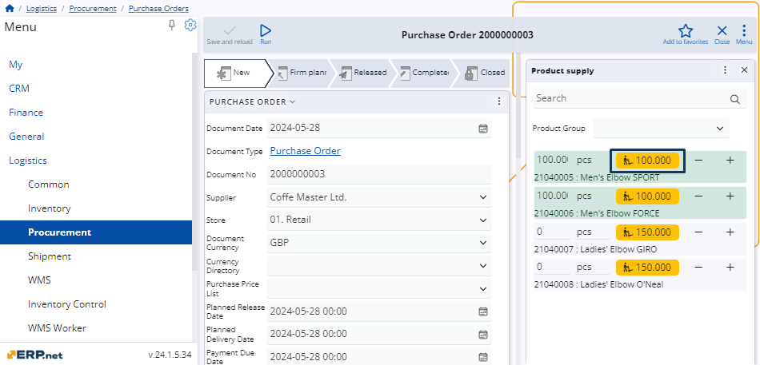

# How to use the Product supply panel 

The **"Product supply"** panel is introduced in the WEB client to improve procurement accuracy and inventory management across different stores and suppliers. 

The panel lists the currently active products available for delivery to the selected Store, filtered by specific document-related filters and offers **automated suggestions for replenishing quantities** for the products based on the applicable **"Product Supply Methods"**.

This provides a real-time approach to replenishing the active product assortment for each supplier and store, reducing reliance on complex algorithms or manual calculations. Additionally, it helps minimize errors, such as ordering products from the wrong supplier or requesting items that should not be ordered.

The panel is accessible within **purchase**, **transfer**, and **work order** documents, with filters applied based on the relevant document data:

* For purchase orders, the list is filtered by the **Supplier** field.
* For transfer orders, it is filtered by the **FromStore** field.
* For work orders, the list is filtered by the **DefaultStore** field.

### Navigation 

To show the **Product supply** panel, you need to open the document form of either a purchase, a transfer, or a work order.

Then, choose **Product supply** from the list of **Functional panels** found within the **Menu** button.

> [!NOTE]
> The panel's buttons will be visible and usable only when you:
>
> * **create** a new purchase, transfer, or work order
> * **edit** an existing purchase, transfer, or work order with status lower than Released.

## Panel features

The **Product supply** panel includes a **search bar** and an option to **filter** products by groups. 

You can enter **quantities** manually, adjust them with “**+**” and “**-**” buttons, as well as determine their **measurement units**. 

Quantities supplied for a product are interpreted as new rows in the **Lines** panel of the respective document.

### Filter by product groups

For convenience, you can filter products for supply by choosing the **product group** to which they belong.

Simply expand the **Product Group** dropdown menu from the **Product supply** panel and select the desired group.

Once selected, only products from the chosen group will appear in the list.

### Set quantities and measurement units 

You can easily **increase** or **decrease** quantities of products available for delivery, as well as **change** their default measurement units.

To do so, you need to be in **Edit mode** for the respective document. 

Then, use the “**+**” and “**-**” buttons to increase or decrease quantities as needed.

### Replenish quantities

The **Product Supply** panel also offers automated suggestions for replenishing quantities for a particular product. 

These are represented by an **orange button** located to the right of the product's measurement unit field. 

Clicking this button will automatically set the product quantity to the suggested value for replenishment.

> [!WARNING]
> Suggestions for replenishment are shown only for products that can be supplied.

> [!NOTE]
> The screenshots taken for this article are from v24 of the Web Client.
