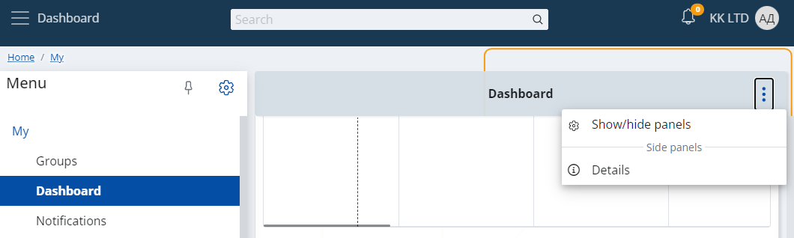

# How to use the Multi-Column Layout

This feature allows you to arrange two panels next to each another on the same row in specific VIEW. The separation line will always be exactly in the middle of the row.

Setting this up happens through the Show/hide panels menu:

Go to the Reorder tab and click on the respective row under the Col column to set which column you would like to take the left side and which column you would like to take the right side:

Close the Show/hide panels menu when you are ready with your selection.

As a result, the row in a view gets separated:

This change doesn't affect the mobile view. The panels there will be above each other as it has been so far.
