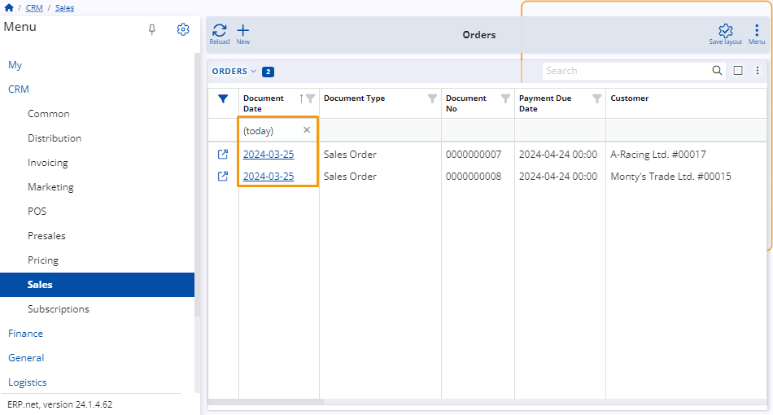
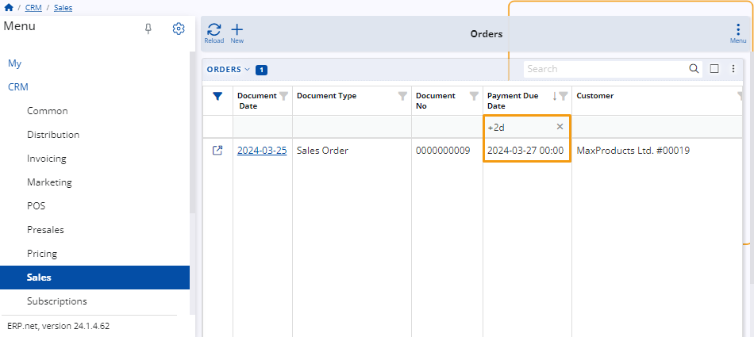
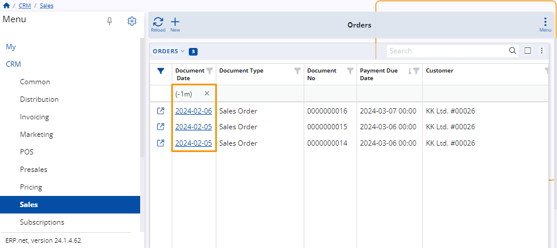
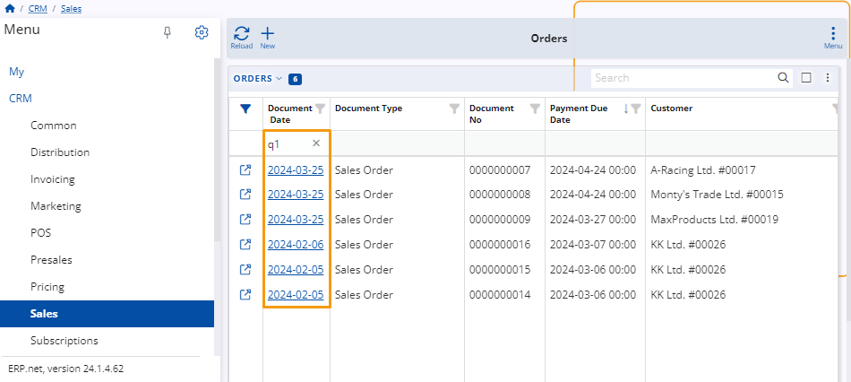
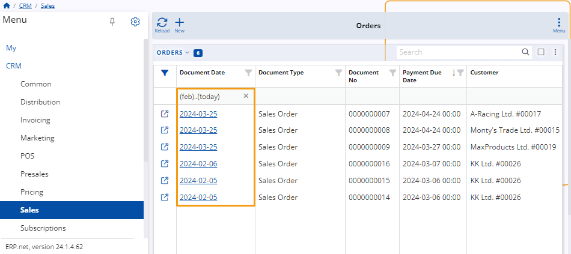

# How to use period expressions 

You can use period expressions to narrow down the scope of what is displayed in a particular navigator.

They are specified in the **filter row** found under the **Document Date** column of the respective navigator.

If the filtering row is not visible, you can **enable** it through the panel's menu.

**Example:**

Within the Orders panel of the Sales module, you input **"(today)"** in the filtering row of the **Document Date** column.

This results in only items created on the **current date** to be displayed in the table.

## Rules and syntax

Period expressions follow a fixed syntax that can influence the outcome they produce.

It's therefore crucial to write them down exactly as they are if you want to achieve the desired effect. 

### Relative time expressions 

These expressions are word-based and surrounded by brackets. You can use them to define specific days which are always relative to the current one. 

Examples include "(yesterday)" or "(last month)". 

### Relative period expressions

These expressions consist of symbols, numbers and letters. You can use them without brackets to limit the scope of a table's results to **specific dates** which are always relative to the current one. 

For example, "-7d" denotes the date exactly seven days before the current one, while "+2d" represents a date exactly two days ahead of the current one.

If surrounded by brackets, relative period expressions can be used to specify **rounded calendar periods** relative to the present moment.

For example, "(-1m)" denotes the entire month that was before the current month, while "(+2m)" represents the entire month that is ahead of the current month. 

### Expressions for quarters and half years

These expressions establish specific intervals or time periods within a broader timeframe. 

For example, "q1" signifies the first quarter of the year, "q2" represents the second quarter, and "h1" denotes the first half of the year.

 

### Custom time periods

You can set custom time periods to limit the results of a table into a specific timeframe. This is achieved by adding ".." between two period expressions.

For instance, "(feb)..(today)" represents the period spanning from the month of February up to and including today.

"(yesterday)..+2d" extends from yesterday to two days onward relative to the current day.

If there is no notation before or after "..", it implies infinity. Thus, "..(last month)" would result in a navigator showing all existing records up until the final day of the last month.

> [!WARNING]
> - Zero as a number (0) or word (zero) specified **without** brackets represents today regardless of whether it's used as a beginning or end.
> - If no indicating letter is specified next to a number, the default convention is **days**, e.g. "-7" is equivalent to "-7d" and "0" represents today.
> - When specifying a period in days, it can be written with or without brackets, e.g. "-7" is equivalent to "(-7)".

> [!NOTE]
> 
> The screenshots taken for this article are from v24 of the platform.
