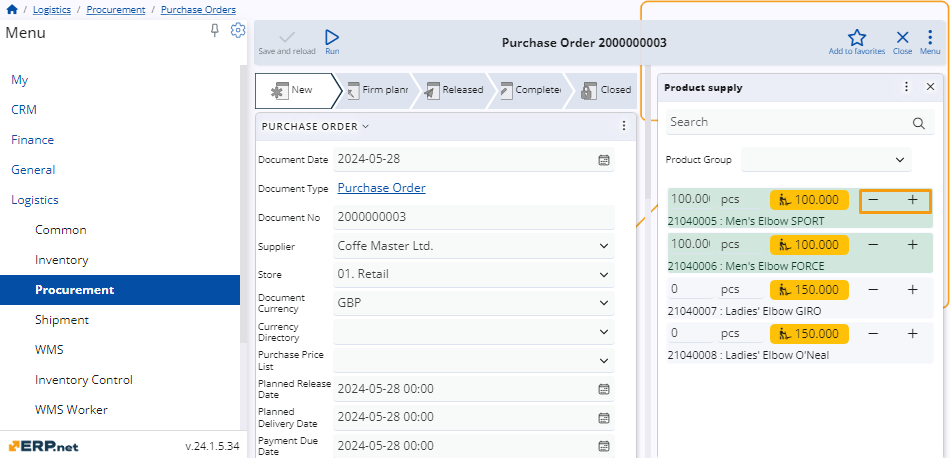
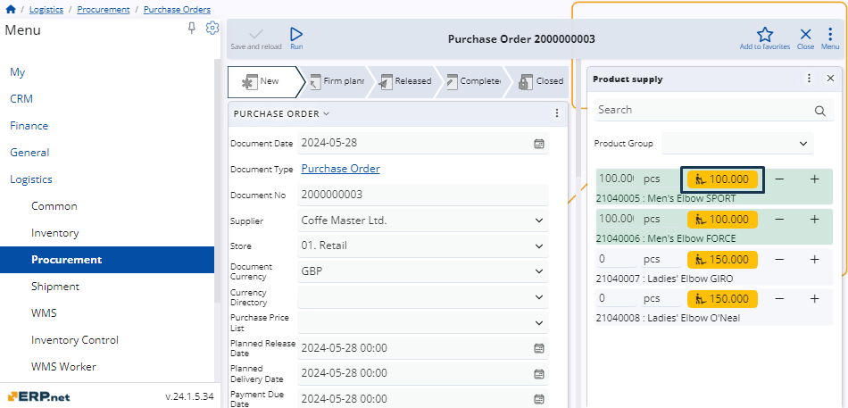

# How to use the Product supply panel 

For **purchase**, **transfer**, and **work order** documents, there's a functional panel called **Product Supply**. 

It displays a list of currently active products available for delivery for a specific store in a particular enterprise company. 

These products are filtered by **PurchaseOrder.Supplier**, **TransferOrder.FromStore**, and **WorkOrder.DefaultStore**, respectively.

### Navigation 

To reveal the **Product supply** panel, you need to open the document form of either a purchase, a transfer, or a work order.

Then, choose **Product supply** from the list of **Functional panels** found within the **Menu** button.

## Panel features

The **Product supply** panel includes a **search bar** and an option to **filter** products by groups. 

You can enter **product quantities** manually, adjust them with “**+**” and “**-**” buttons, as well as determine their **measurement units**, 

Quantities which are supplied will be interpreted as new rows in the **Lines** panel of the respective document.

### Filter by product groups

You can limit the reach of products available for delivery in the **Product supply** panel by filtering them by product groups. 

Simply expand the **Product Group** dropdown menu and select the desired group.

Once selected, only products from the chosen group will appear in the list.

### Set quantities and measurement units 

You can easily **increase** or **decrease** quantities of products available for delivery, as well as **change** their default measurement units.

To do so, you need to be in **Edit mode** for the respective document. Then, use the “**+**” and “**-**” buttons to increase or decrease quantities as needed.

### Replenish quantities

The **Product Supply** panel also offers automated suggestions for replenishing quantities for a particular product. 

These are represented by an **orange button** located to the right of the product's measurement unit field. 

Clicking this button will automatically set the product quantity to the suggested value for replenishment.

> [!WARNING]
> Suggestions for replenishment are shown only for products that can be supplied.

> [!NOTE]
> The screenshots taken for this article are from v24 of the platform.
