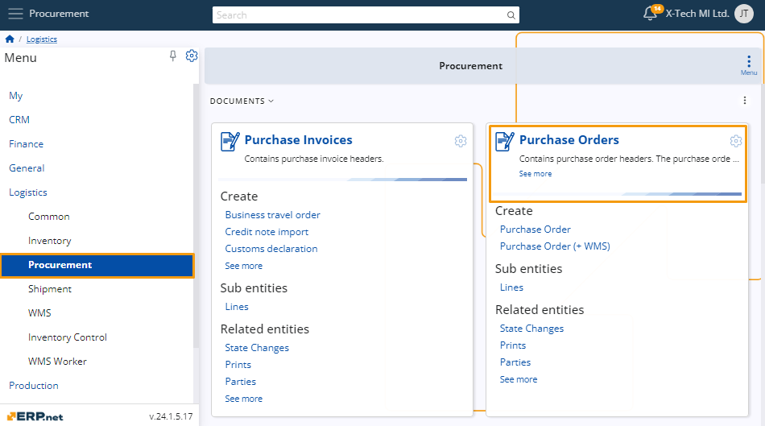

# Product supply panel 

In the **Purchase Order**, **Transfer Order**, and **Work Order** documents, there's a functional panel called **Product Supply**. 

This panel displays a list of products available for delivery at a specific store within the company. 

It filters products based on the procurement method, whether it's **PurchaseOrder.Supplier**, **TransferOrder.FromStore**, or **WorkOrder.DefaultStore**.

## Navigation 

To open the **Product supply** panel, you need to navigate to a document of which kind it’s available. 

Once you’ve opened one, click on the **Menu ** button, and from it click **Functional panels** and a drop-down menu will open, choose **Product supply**, and the panel will open next to the document window.  

## Product Panel Information

The **Product Supply** panel includes a search bar and an option to filter by product groups. 

You can adjust the product quantity using the “+” and “-” buttons. 

There is also an orange button displaying the amount suggested for the product. 

*Placeholder - Image* 

### Filter by product groups

You can display products from a specific group in the **Product Supply** panel for your convenience. 

To do this, open the **Product Group** drop-down menu and select the desired group.

Once selected, only products from the chosen group will appear in the list.

## Buttons to change the quantity 

In the **Product Supply** panel, you can view and adjust the quantity of listed products. 

Use the “+” and “-” buttons to increase or decrease the quantity as needed.

*Placeholder - Image*

### Suggested quantity button

In the **Product Supply** panel, an orange button is located between the unit count and the “+” button. 

*Placeholder - Image*

Clicking this button will automatically set the suggested quantity for that product.

*Placeholder - Image*

[!] Note: This button is displayed only for products that are available for supply.

