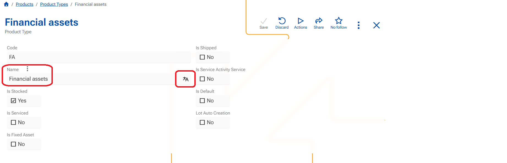
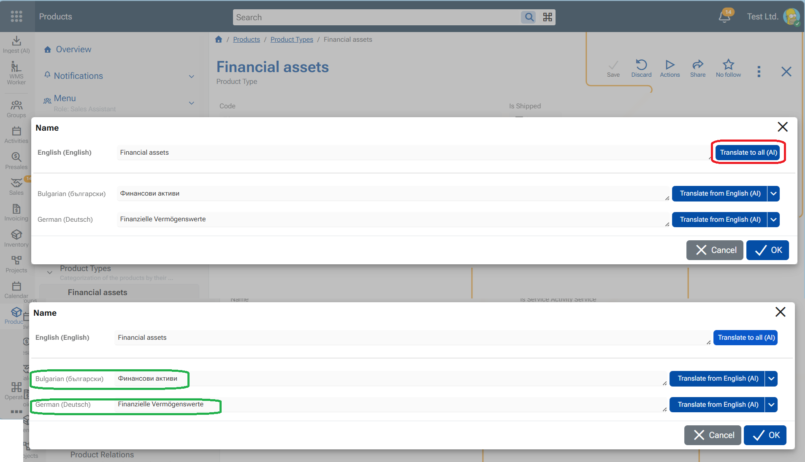
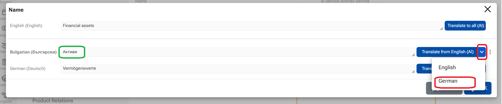

# How to translate multilanguage fields in @@webclient

This example shows how to translate a product **Name** field when a value exists in one language and needs to be translated into the other active languages.

### Scenario

- **Field:** Product Name (multilingual)
- **Existing value:** in English is "Financial assets"
- **Active platform languages:** English, Bulgarian, German
- **Goal:** Translate the English value into Bulgarian and German

### Steps

1. Open the record in **Edit mode**.
2. In the multilingual field, click **Translate**.
3. The **multilanguage editor** opens.
4. Click **Translate to all (AI)** button next to the English value in the top language field

   The system translates the value from the **source language** (English) into all other active languages that do not yet have a value.

   All fields below are filled with translated values eg. BG "Финансови активи", GE: "Finanzielle Vermögenswerte"

### Translating individual languages

- Next to each language field, you can use the **Translate from...** button to translate **only that specific language**.
- Once any language field contains a value, it can be used as a **source language** for translation to the others.

eg. Translate from German - source GE: Vermögenswerte into Bulgarian - result  BG: "Активи"

### Additional options

Click the **three-dot menu** next to a language field to access more actions:

- **Copy**  
  Copies the value from the source language and places it into the selected field.

- **Transliterate**  
  Transliterates the value from the source language and places it into the selected field.  
  This is **not** a translation.
