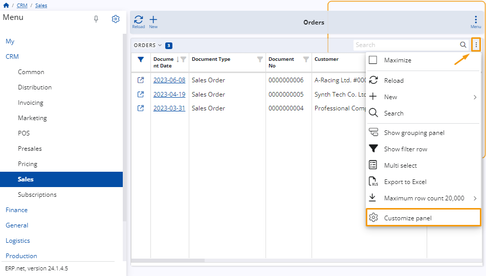

# A Step-by-Step walkthrough for customizing a table in ERP

When customizing the sales columns, you have the flexibility to
rearrange the columns within a table and also assign new names to them.
Use this feature to tailor the table according to your specific requirements.

## Example:

Head to the **Sales** page in the **CRM** menu and access the **Orders** panel.

Upon doing so, a table containing the orders will be presented. Open the menu located in the top right corner of the table and select the **Customize Panel** button.

This action will prompt a window with two tabs. Navigate to the **Reorder** tab.

To rearrange the columns, simply drag and drop the items within the list.

For column renaming, click on the **Rename** button corresponding to the column you wish to modify.

Enter the desired name for your column and click the **OK** button to save the changes.

The column will now has the name you assigned to it.

To undo the renaming, click on the **Rename** button. 

Use the **Clear** button to clear the field. 

If left blank and then confirmed with **OK**, the name will revert to its original state.

