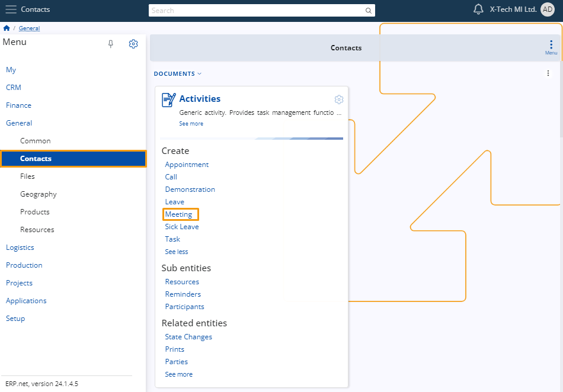
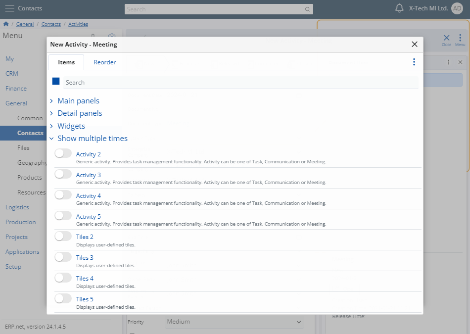

# A Step-by-Step walkthrough for adding multiple instances of a panel type in ERP

Customizing the UI for a form enables you to personalize it by displaying certain panels
multiple times. Each added panel in the form is assigned a unique name, which can be modified
as necessary. A panel cannot be displayed more than five times within a single form.

## Example

Head to the **Contacts** section and within the **Activities** creation area, access the **Meeting** option.

After selecting **Meeting**, a window will appear, presenting a form for creating a new meeting. To tailor the form to your preferences, access the menu and choose **Customize form**.

This action will open a window with two tabs. Navigate to the **Items** tab, revealing a list with dropdown menus.

Click on **Show multiple times** to open a menu with slide buttons.

By sliding a button, you can add an item to the form. Each item can be added multiple times using the four sliders available.

If necessary, you can rename each item on the form. To do so, navigate to the **Reorder** tab, displaying all items currently added to the form. Click on the **Rename** icon for the specific item you wish to rename.

Enter the desired name and click the **OK** button to save the changes.

After you do that, the item's name will be permanently changed. 

