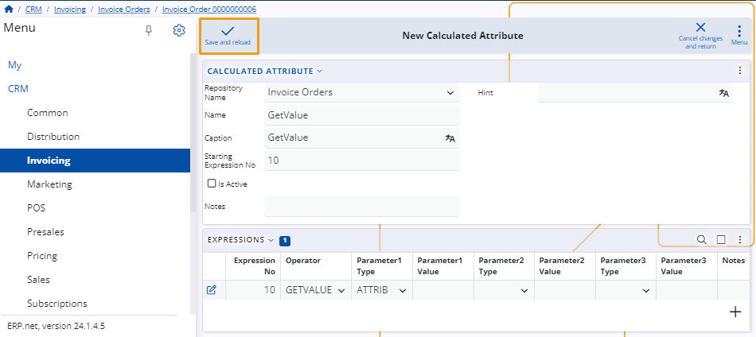

# A Step-by-Step walkthrough for creating new stored or calculated attribute in ERP

While customizing a form, you have the option to introduce either a new stored attribute 
or a new calculated attribute. The inclusion of these fields will be automatically reflected in the form you are currently customizing. 

## Example 

Head to the **Invoicing** page within the **CRM** menu and access the **Invoice Orders** panel.

Once there, a list of orders will be displayed. Select the specific order you intend to modify.

Within the Invoice Order's page, open the menu of the **Invoice Order** panel and click on the **Customize Panel** button.

This action will open a window with two tabs. Navigate to the **Items** tab and access the menu at the top right corner. Choose either **Add New Stored Attribute** or **Add New Calculated Attribute**.

To introduce a new attribute, fill in the details for the **New Calculated/Stored Attribute** and click the **Save and Reload** button to apply the changes.

In the **Items** list, you'll find dropdown menus corresponding to the two options in the previous step. 

The new attributes will be automatically added to the corresponding lists. Activate the attributes you need by using the sliding buttons.

