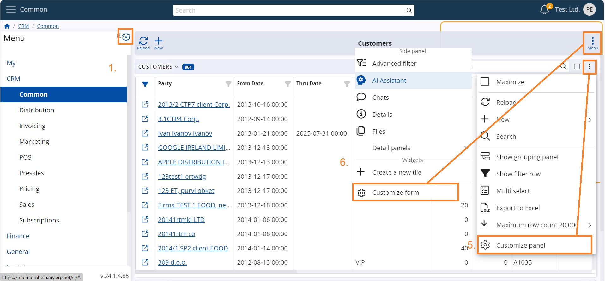
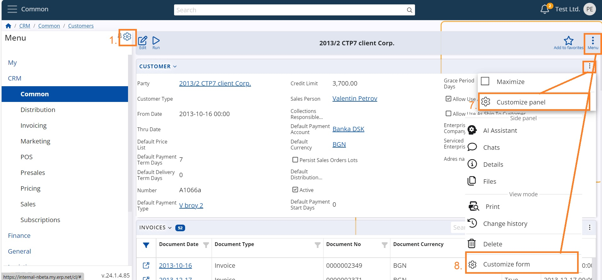

# Access to views customization

In order to be able to organize the vision and usability of the platform a User needs to have permissions. It is advised that only Admins bear such responsibility. 
Common users do not normally have rights to personalize their working environment and in general get accustomed to the settings. 
Here is a short explanation on access to WEB customization of Menu, Views, Panels and Forms depending on the User status.

* If the User IS Global Layout Manager - full access span 1-8 
* If the User IS NOT Global Layout Manager and option "Is Layout Admin" of the Role IS NOT active - Zero access
* If the User IS NOT Global Layout Manager and option "Is Layout Admin" of the Role IS active – access span 1-6

<b>Access span:</b>

**From the initial screen of any Module you can:**
1. Customize Main menu 
2. Customize panel – which categories, sub entities and related data to be shown in the panel of a namespace 
3. Customize form of Modules 
4. Customize view – which panels to be available in the form

  
**Inside the Navigation panel of a Namespace you can:**

5. Customize panel – which columns and related data to be shown 
6. Customize form – what additional panels and related data to be shown 

  
**Inside an entity (object) you can:**

7. Customize panel – which fields to be shown in the single form
8. Customize form  - what additional panels and related data to be shown

  
Make sure to familiarize how to [Separate views by object category](separate-views.md)

