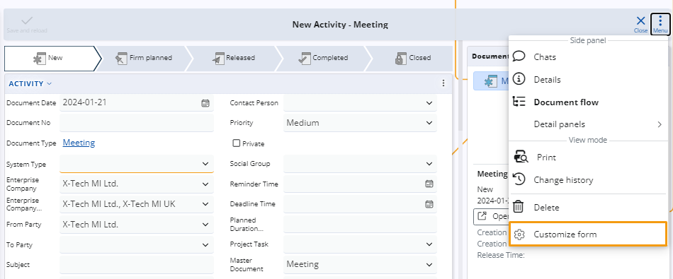

# How to add multiple instances of a panel type

While customizing a form, you can add certain panels in it **multiple** times. 

Each added panel is assigned a unique name, which can be modified when necessary. 

One and the same panel **cannot** be displayed more than **five** times within a single form.

### Add panels

You can customize a form by clicking on the **Menu** button and choosing **Customize form**.

In the window, navigate to the **Items** tab аnd click on **Show multiple times** to expand a menu with slider buttons.

By clicking on a slider, you can add or remove the same panel from the form no more than five times.

### Rename a panel

If necessary, you can **rename** each panel to better customize it for your form. 

To do so, navigate to the **Reorder** tab and click the **Rename** button for the specific panel you wish to rename.

Enter the desired name and click **OK** to save the changes.

You can supply a translation in a language of your choice with the translate button in the Rename window.

