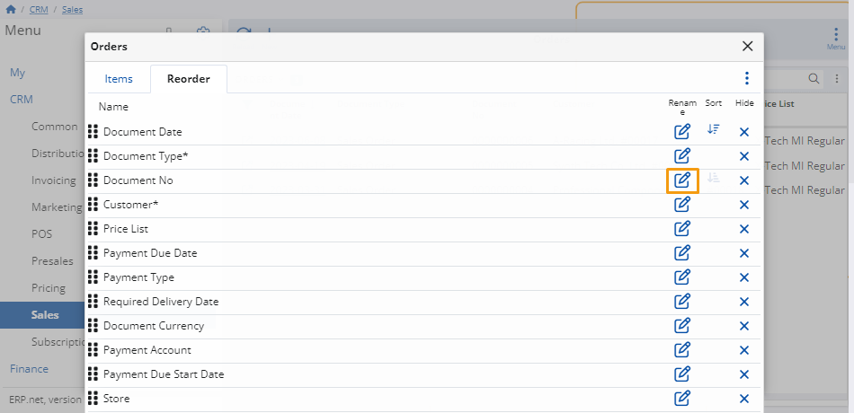

# How to customize fields

When customizing panels, you can rearrange their column fields and also assign new names to them.

Use this feature to better adapt each panel to your specific needs.

### Rearrange

Click the **three-dot button** at the top right corner of a panel and select **Customize panel**.

In the window, within the **Reorder** tab, click and drag the columns up and down to choose where each of them appears.

### Rename a column

To change the name of a column, click the **Rename** button on the right of the column you want to modify.

Enter the desired name for your column and click **OK** to save the changes.

To reset the name back to its original state, use the **Clear** button.

