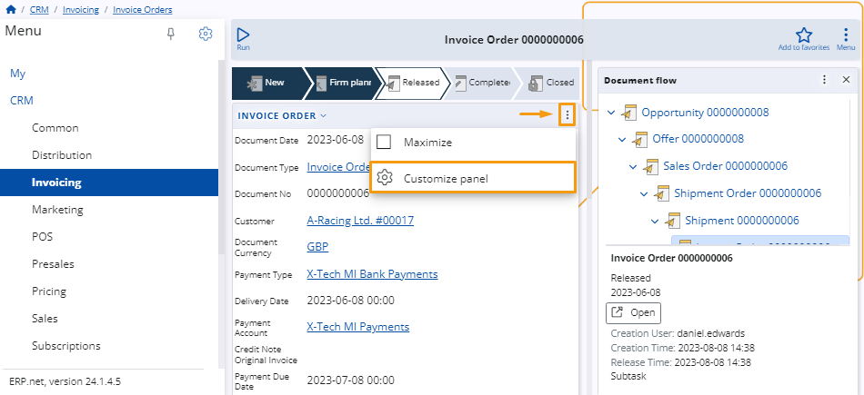
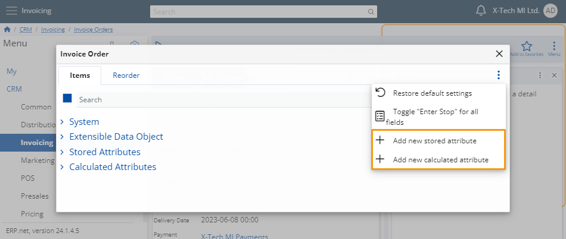
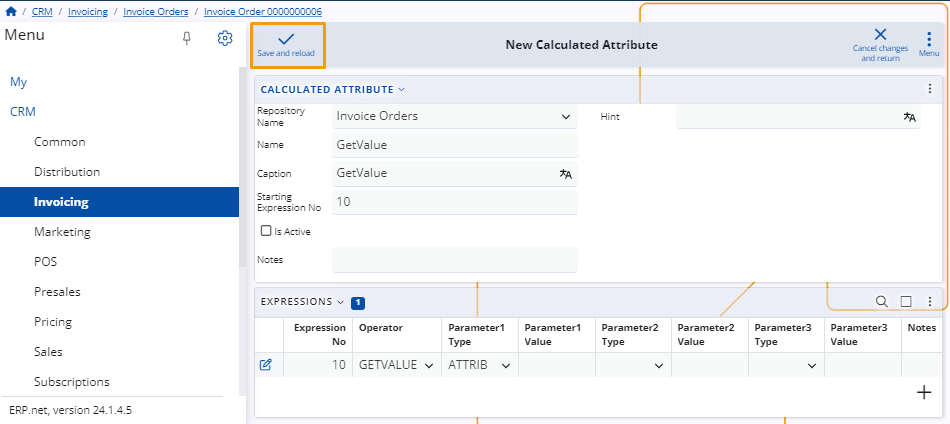
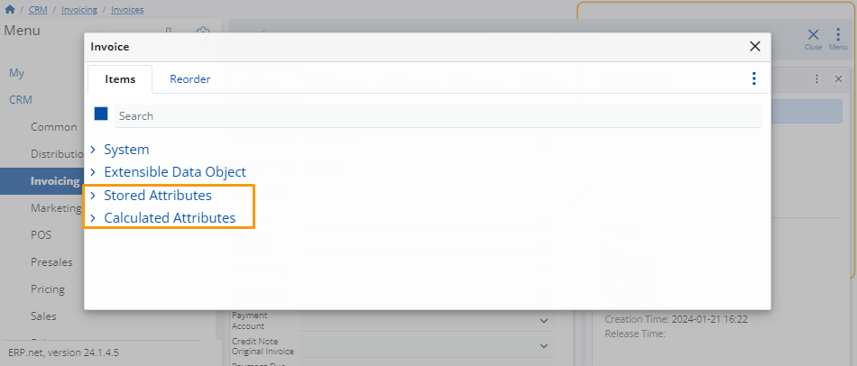

# How to create new stored or calculated attributes

While customizing a form, you have the option to introduce a new stored attribute or a new calculated attribute. 

The addition of these fields will be automatically reflected in the form you are customizing. 

## Example 

Within an invoice order, click the **button** at the top-right corner and select **Customize panel**.

In the window, within the **Items** tab, click the **three-dot** button. 

You can choose to add a new **stored attribute** or a new **calculated attribute**.

You'll be taken to a separate form for the creation of the attribute.

When you fill all the necessary details, click **Save and Reload** to apply the changes.

The new attribute will be automatically added to its respective list within the **Items** tab. 

Enable or disable the attributes you need by clicking their slider buttons.

