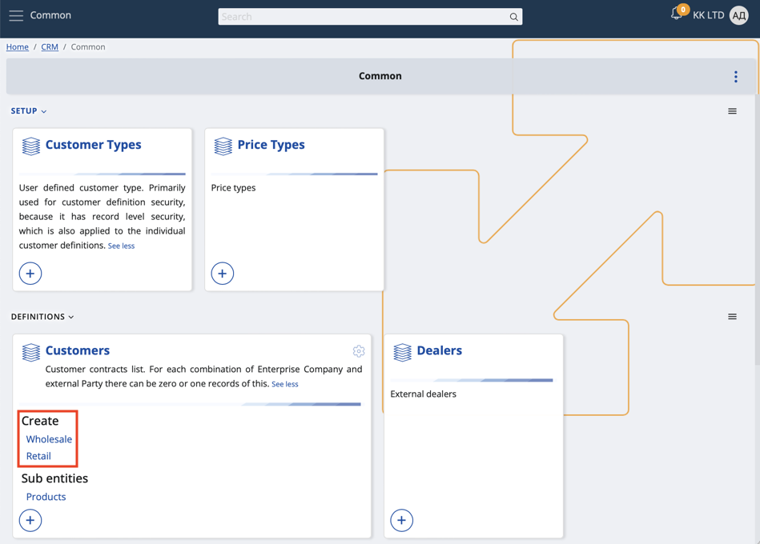

# How to separate views by object category

**Object categories (OCs)** can be accessed from within the panels of bigger entities such as Customer, Asset and Document.

You can enable or disable them for different creation forms and make the views of these forms **distinguishable** from one another.

### Example

Different document forms will prioritise certain fields over others. 

When issuing a return of a product, for instance, you may want to request the original price but not the birth date of a client.

Depending on its use-case, an object category can represent one or more **types** - Customer Type, Asset Type and Document Type.

Thus, it's possible to start creating a document or an entity with an object category **already** selected for it.

#### Here's a list of data types and supported object categories:

Applications / Asset Мanagement: Managed Asset - Managed Asset Type

Applications  / Rental: Asset - Asset Type

Applications / Service: Service Object - Service Object Type

CRM / Common: Customer - Customer Type

Finance / Assets: Asset - Asset Category

General / Common: Parties - Party Type (exception, because it is an Entity Type specifier)

General / Common: Document - Document Type (exception, because documents are also separated by leaf entity type)

General / Products: Products - Product Type

Logistics / Common: Logistic Units - Logistic Unit Type

Logistics / Procurement: Supplier - Supplier Type

## Process

1. You need to have at least one type of a document. 

For example, the **Create** section of the **Orders** panel may offer a direct sales order, a POS sales order, a standard sales order, and more. 

If the available options are not what you're looking for, you can manually add **custom** document types. 

This is typically done with the **circular plus button** found on the respective panel.

2. Click a document type visualized on the main panel (e.g. Direct Sale Order)

This will take you to the creation form of the document where an **object category** is already applied.

Keep in mind that the field will be **read-only** and unable to be changed.

3. Customize the view of the form through the **Show/hide fields** window. This allows you to enable or disable specific fields. 

Clicking outside the window once will save the view for the current document, but the settings will be reset for another document.

Every time you're creating a direct sales order, your experience will be unique from, say, creating a return order. 

