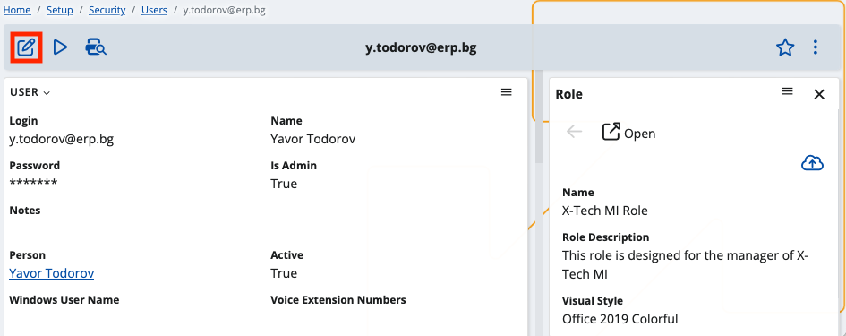
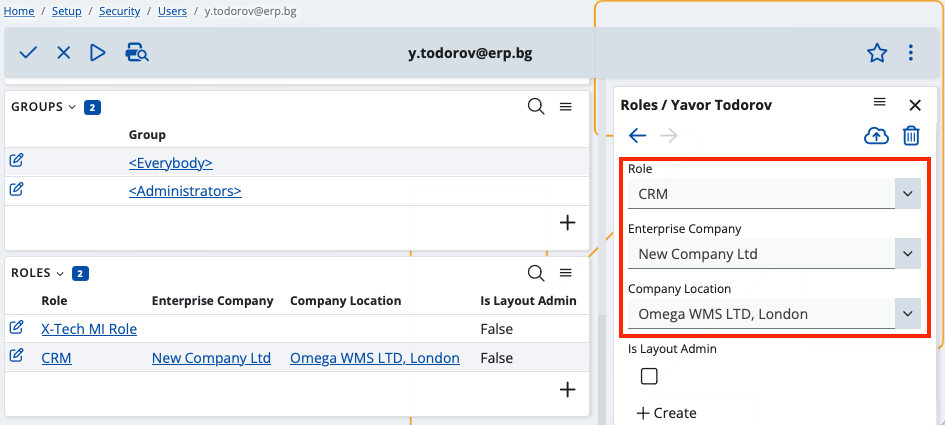

# How to define user roles

You can assign roles to security users and link them to specific **enterprise companies** and **company locations**. 

This option grants different permissions and responsibilities based on an employee’s workplace and department. However, the roles you’re allowed to define will **vary**. When companies are matched with locations, you can choose only the most suitable entries per combination. 

By default, users without predefined enterprise company and company location have role access to **all** of them.

## Prerequisites 

Make sure the **Roles panel** is part of the user’s standard settings definition. 
 
Open the list of default panel and toggle the **Roles** slider.

This will add the panel to the user’s settings and allow you to define and change custom roles.
 
## Role definition

In the Roles panel, you can link one or more roles to a user. 

Their scope can be configured to cover that user’s enterprise company and company location.

1.	Enter **Edit Mode** to be able to change settings.

 
2.	Navigate to the **Roles** panel and click the **plus button** to add a new role.

 
3.	Within the expanded side tab on the right, choose values for the **Role**, **Enterprise Company** and **Company Location** fields.   The latter two will determine which roles will appear on the list.  

 

4.	**Apply** your settings.
