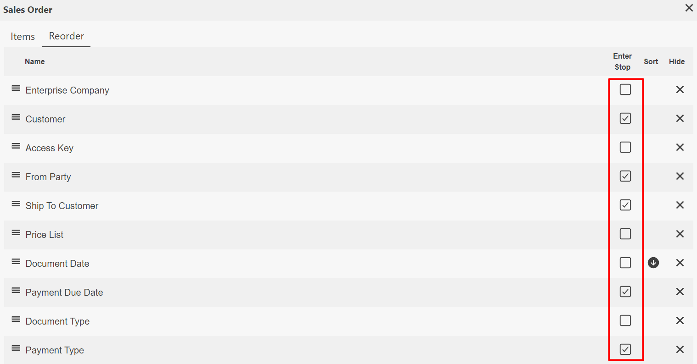
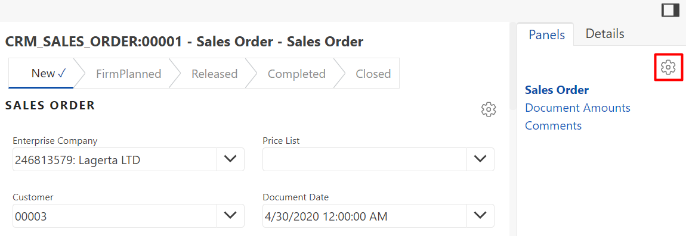
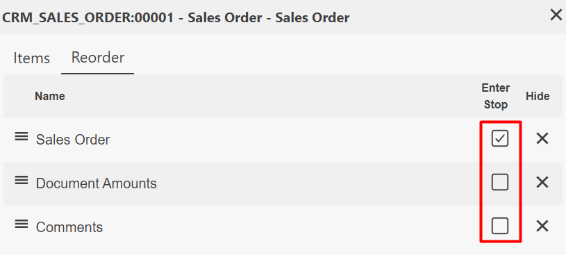
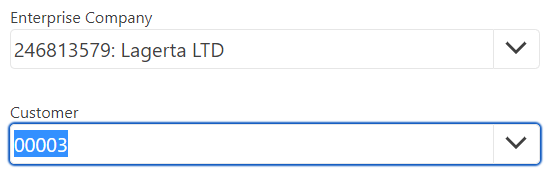
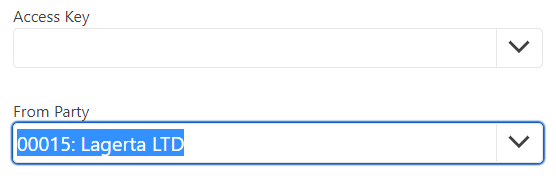

# Enter stops
<b>Enter stops</b> can be used to speed up the process of creating and editing data fields. 
They prioritize essential steps by leaving out those the user may want to easily skip. 
Whether it is for fields or panels, enter stops allow for faster and more intuitive management of pages. Unlike the tab key, which always goes through each and every field and panel, the Enter key’s usage can be customized. 
When editing the document, if enter stops are configured and you are pressing the enter key when you are done editing a field, some fields will be skipped and the cursor will automatically move from one important field to another. 

## Setting enter stops with data fields
In Edit mode, you can choose which data fields work with enter stops by clicking the <b>Settings</b> icon at the top right corner of a document.

 
 
From there, navigate to the <b>Reorder</b> tab. Take a note of the boxes under <b>Enter Stop</b>. 
During editing, fields with checkmarks are <b>prioritized</b> while empty ones are <b>skipped</b>. 
This setting won’t delete them from the database. Select the ones you <b>will more likely need</b> to fill out every time you create a sales order, and close the window. 

 

## Setting enter stops with panels
Further to individual fields, you can also choose which entire panels should be skipped and which ones should be prioritized. 
You can configure this behavior by clicking the <b>Settings</b> icon at the Panels section.

 
 
From there, navigate to the <b>Reorder</b> tab again, select which panels should be considered enter stops, and close the window. 
The ones without the checkbox will be skipped when pressing the enter key while editing the document.

 

## Using enter stops 
To put the changes you’ve made into practice, simply press the <b>Enter</b> key while editing a document. 
Doing this again moves the blue highlights from one <b>prioritized</b> field to the next. 
The highlighted path follows the fields with checkmarks in a chronological order.
In this case, the user starts with “Customer” and goes directly to “From Party”, skipping "Access Key".

  

Enter stops can be applied not only to fields but also to <b>icons</b> and <b>buttons</b> such as <b>Next</b> and <b>Create New</b>, this way significantly speeding up the editing process compared to only click-based programs.
