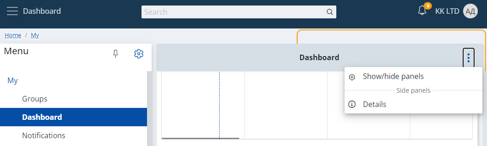

# Multi-Column Layout

This feature allows you to arrange two panels next to each another on the same row in specific VIEW. The separation line will always be exactly in the middle of the row.

Setting this up happens through the Show/Hide panels menu:

As a result, the row in a view gets separated:

This change doesn't affect the mobile view. The panels there will be above each other as it has been so far.

