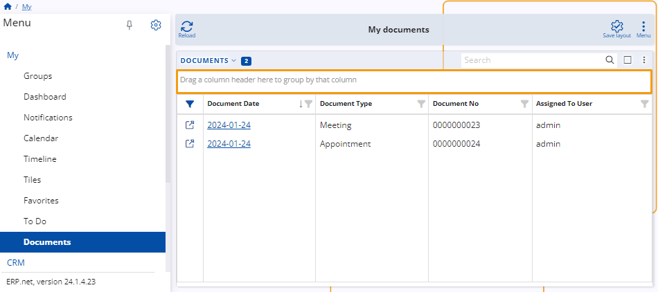
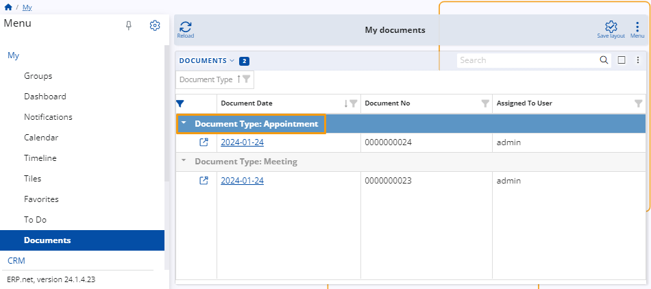
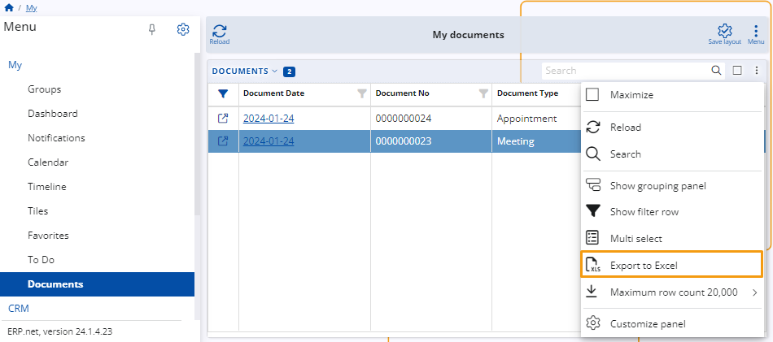
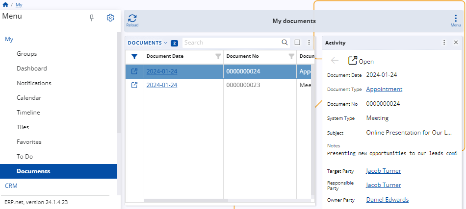
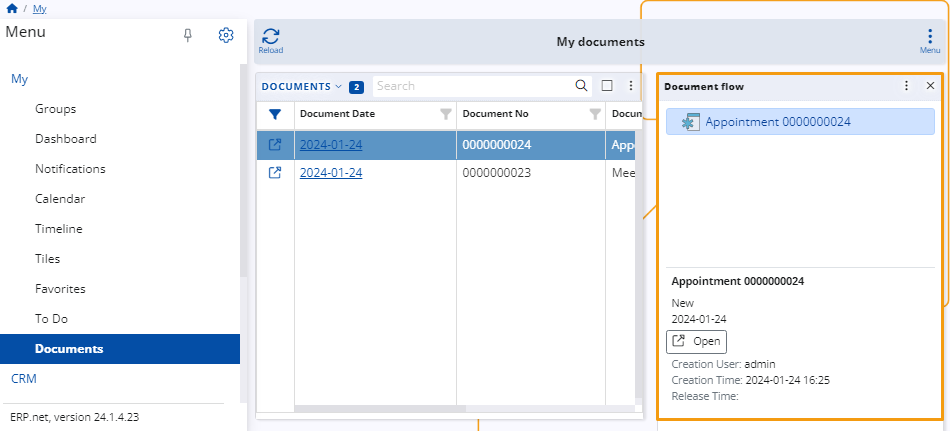

# Documents

In the **My** menu, the **Documents** application is dedicated to organizing documents linked to your personal account. 

It conveniently gathers all files authored by you or assigned to you by others. 

This application offers customization options to tailor the display of document details according to your preferences.

## Navigation

To open the **Documents** application, access the main menu and select the **My** section. 

From there, locate the option labeled **Documents** and click on it to launch it.

## My Document Layout

Here, you will find details about the primary layout of the **My Documents** page. 
This includes insights into the various buttons, fields, customization features, and menus available to you for navigating and organizing your documents.

**Note**: After making any modifications, a **Save Layout** icon will appear, providing you with the option to permanently save the changes to the layout.

### Documents Table

The primary focus of the screen is a table presenting all documents linked to your account.

You can hide and show it from the drop-down menu labeled **Documents**.

#### Search

You can use the search bar within the table to browse through the documents.

#### Maximize

Maximize the table by clicking on the maximize icon.

#### Panel Menu

You can use the **Panel menu** to add widgets to the table and also apply them for enhanced functionality.

##### Show Grouping Panel

The **Grouping panel** arranged the documents based on a certain parameter.

To add the **Grouping panel**, click on the **Grouping panel** button in  the **Panel menu**.

You can drag and drop a column header to the **Grouping panel**, and the documents will be arranged based on that column. 

**Example**: If you drag and drop the **Document Type** column, the documents will be arranged by type.

You can group the documents by more than one parameter. 

In that case, the documents will be arranged in two menus where the second parameter’s menu is inside the first one.

**Note**: To change the sequence of the parameters, drag and drop them on the **Grouping panel**.

##### Show Filter Row

To search for a document based on information in a specific column, you can display the Filter row from the **Panel menu**.

Enter a keyword or number in the column's filter cell to filter the documents accordingly.

##### Multi-select

With **Multiple select**, you can select more than one document.

To select one or more documents, simply check the box next to each document you wish to select. Alternatively, you can check the box at the top of the column to select all documents.

##### Export to Excel

With **Export to Excel**, you can download all of the files in **My Documents** in **xlsx** format.

##### Set a Maximum Row Count

You can set a maximum number of rows for the table within **Maximum row count**.

##### Customize Panel

When you open it, a window with two tabs will open. **Items** and **Reorder**.

- **Items**: You can add columns to the table from the **System menu** of the **Items** tab. To do that, click on the slider button next to the desired one.

  

  When you do that a column will show on the table.

  
  
- **Reorder**: Reorder the columns by your preferences by dragging them up and down.

  

  **Note**: You can also reorder the columns by dragging and dropping them in the table.

  

### Reload

You can refresh the table as needed by using the **Reload** button.

### Menu

In the **Menu**, you can add and open **Side panels** and **Widgets** to your screen.

#### Side Panels

You can add **Side panels** to the screen to help you with your work while you are working with your documents.

##### Chats 

Opens a chat next to the table with documents.

##### Details 

Open a new window displaying details about the selected document.

##### Document Flow 

Open a new window displaying information about the document flow.

##### Detail Panels

Choose from the drop-down menu a panel to add to the screen.

#### Widgets

Use the available **Widgets** by clicking them in the menu.

##### Create a New Tile

You can add a new tile to **Tiles**, that will show the **Documents** in **My**.

##### Customize Form

You can customize the view of your Documents application.

When you open it, a window with two tabs will open. Items and Reorder.

- **Items**: From the Items tab, you can add and remove items from your form.
  
  - **Main Panels**: The Documents panel is the only option available, and additional panels cannot be added.
    
  - **Widgets**: Activate the buttons adjacent to Favorites, Tiles, and Web views to add them.
    
    
    
  - **Show Multiple Times**: You can display a tile up to five times by toggling the buttons next to them.

    
    
- **Reorder**: Reorder the items by your preferences by dragging them up and down.

