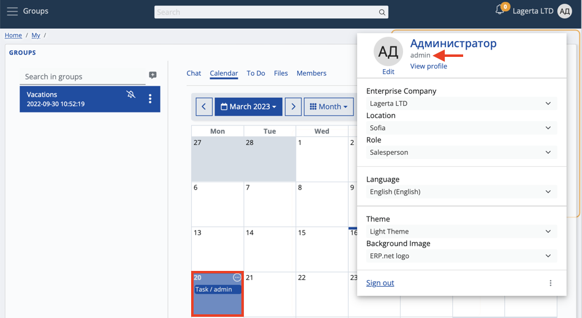
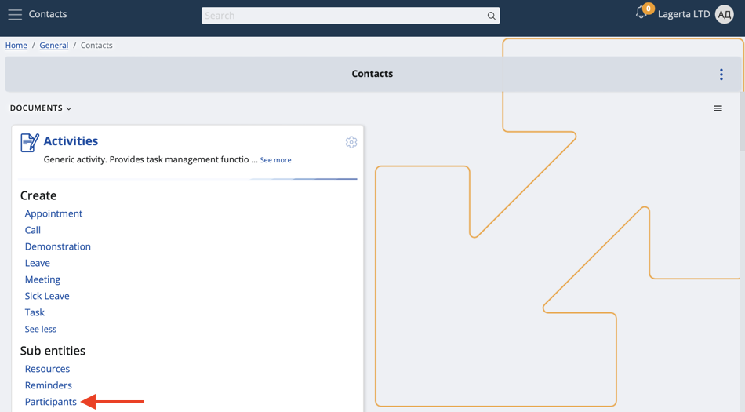
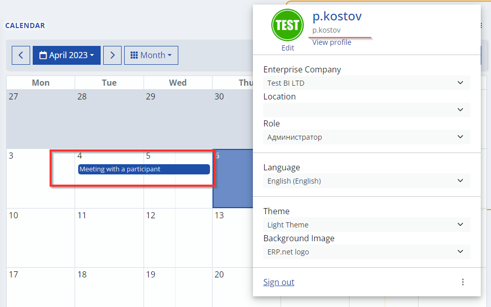

# Activity participants

Your calendar is capable of displaying both the activities that you **own** and the ones you **participate** in.

This allows for better task management and increases the level of interaction you can achieve on the **My Calendar** application.

### How it works

A person of type "Owner" is capable of defining up to **two** entities of type "User". 

By default, whenever owners create a new activity, their related entities have it automatically added in their personal calendars.

The same logic can be applied to an activity's **participants**.

## Process

Any user can view and access a task, meeting, or other forms of activities they're scheduled to take part in.

However, they must first be defined as **participants** on the platform.

1. Make sure your participant is registered as such on the **General -> Contacts -> Participants** module.

If not, create a new one from scratch by providing all necessary information.

2. Create a new activity directly from **My Calendar** or from the **General -> Contacts -> Activities** module.

If the Participants panel is absent, enable it through the **Show/Hide panels** button.

3. When you add the user(s), **finish** the creation of the activity.

Participants will now be able to see and access it from within their own personal calendars.

#### Note!

If you’re both an owner and a participant of the same activity, you **won’t** have a duplicate of it in your calendar. 

The same is true for participants accidentally added more than once in the activity. 
