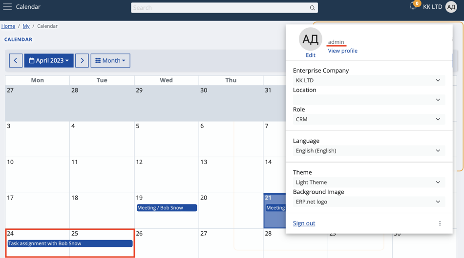
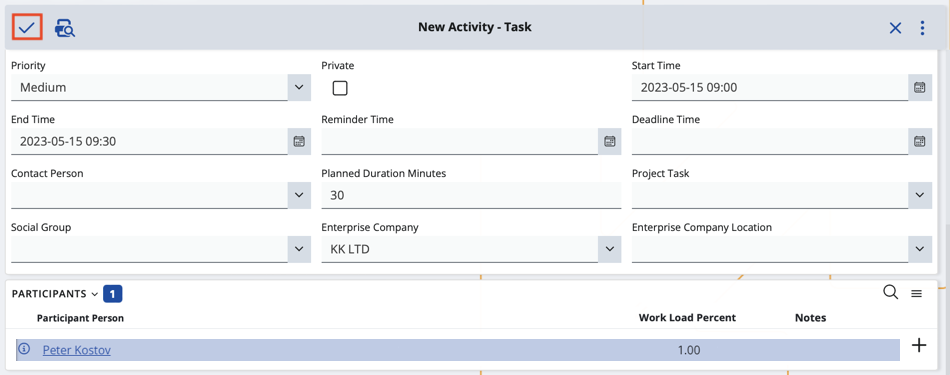

# Activity participants

Your Calendar is capable of displaying both the activities that you **own** and the ones you **participate** in.

This allows for better task management and increases the level of interaction you can achieve on the **My Calendar** application.

### How it works

By default, whenever owners create a new activity, related participants have it automatically added in their own calendars.

## Process

Any user, including yourself, can view and access a task, meeting, or other forms of activities they're scheduled to take part in.

1. Schedule a new activity directly from **My Calendar**.

If the **Participants** panel is absent, enable it through the **Show/Hide panels** button.

2. Add the participant(s) you need and then **finish** the creation of the activity.

The participant will now be able to see and access it from within their own **My Calendar** application.

#### Note!

If you’re both an owner and a participant of the same activity, you **won’t** get a duplicate of it in your Calendar. 

The same is true if you're accidentally added more than once in the activity. 
