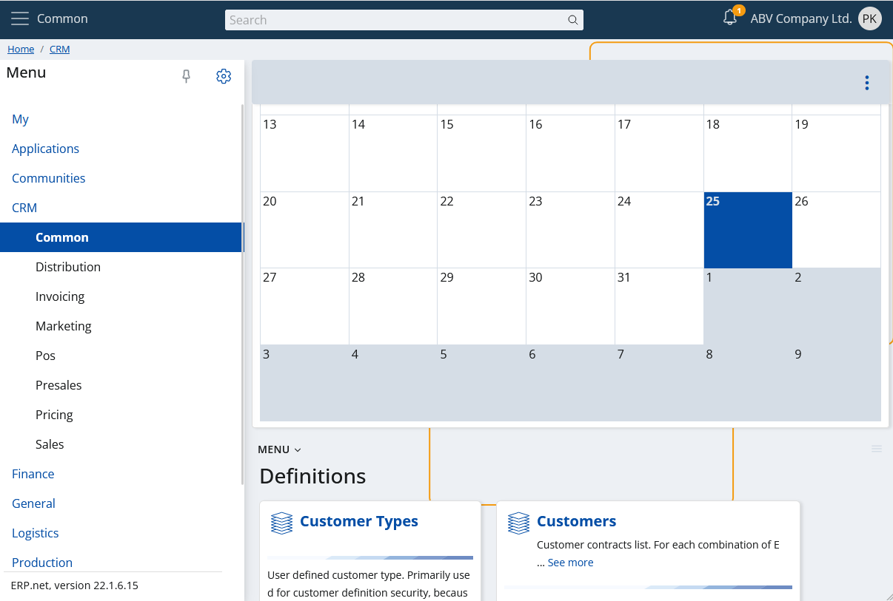

# Calendar

The **ERP.net Web Client Calendar** is a powerful time-management tool, allowing users to efficiently organize, monitor, and synchronize activities, events, and tasks. 

It consolidates group activities, promoting collaboration. Its features include creating events, customizing views (e.g., Workweek, Month), navigating dates, and accessing scheduled events easily.

Typically, calendars are divided into distinct units of time, such as days, weeks, and months, each represented by a grid or series of pages. 

They often include features such as markings for holidays, special occasions, and personal reminders, enabling users to stay informed and prepared for upcoming events. 


## Activities

This is the main goal of the calendar in the @@webclient.

It will show in a convenient way all your activities. This way you can see them in a convenient, natural way, without the need to open navigators, apply filters, etc.


Also you can create a new activity. Just click on the "Create" button:


Fill in the required fields, save it and you're done. The new activity will appear on the day for which it's planned.

## View types

The calendar app supports different view types. You can switch between them from the app's panel settings.


When you choose the new type of view, the changes will take effect immediately.

### Monthly

The default view type. Self-explanatory, shows the days of the selected month, alignining the raster with the days of the previous and next, graying them out. 


### Workweek

An alternative view, showing the five days of the selected work week as columns. The working time will be visualized on the vertical axis. 


## Smart responsiveness

Why smart? Because it doesn't just scale to the size of your screen, but it takes into account how you really could use it, according the size of your screen. 

If your screen doesn't show a large area (e.g., your mobile), then the so-called responsiveness comes.


That's the monthly view on a mobile. Yes, it's not just scaled, it's a different layout to fit your needs. The activities are shown as "dots" and now you have agenda. Click (more specifically "touch") on a day and the agenda will show your activities as a list.


Additionally, you may notice that the calendar's toolbar is refactored. Now you have header and footer toolbars.


## Mobile touch gestures support

Mobile touch gestures are also supported. You can swipe left or right on your screen and as a result, you will move the calendar backward or forward.

## I am a widget

This is not something new for a "My app", but rather a key functionality. You can add a calendar wherever you want as a widget panel.




## My Calendar as an inline control

My Calendar is also present as an inline control anywhere in @@webclient where you need to enter a date.

Here's an example when creating a new [activity](https://docs.erp.net/model/entities/General.Contacts.Activities.html) where you need to set the [document's date](https://docs.erp.net/model/entities/General.Contacts.Activities.html#documentdate).


In addition to date, time input is also supported.


The calendar will automatically allow time input when the property you're editing requires it. As in the example from above - when specifying the date and **time** for a reminder in [to do task](https://docs.erp.net/model/entities/Projects.Todo.Tasks.html#remindtimeutc).

Here's what the same control looks like, but in mobile view:


Of course, sometimes you only need to enter an exact time. The calendar will adapt and display only the time:


### Time presets

The time seletion in the control is presented as a list of convenient predefined times:

- 10:00 / Morning
- 12:30 / Lunch
- 14:00 / Early afternoon
- 16:00 / Late afternoon
- 19:00 / Dinner

If you want to set another time, you can do it manually via the input at the bottom.

### Customizing time presets

It's also possible to completely redefine the time presets to suit your needs.

This can be done via the global configuration options via the key [`Calendar/TimePresets`](https://docs.erp.net/tech/reference/config-options-reference.html#49-calendartimepresets).

When this key has value, conforming to the format below, it overrides the default time presets.

```
<PresetName1>=<H>:<M>;<PresetName2>=<H>:<M>;...
```
e.g.,
```
Morning=10:00;Lunch=12:30;Afternoon=15:00;Dinner=19:00
```
