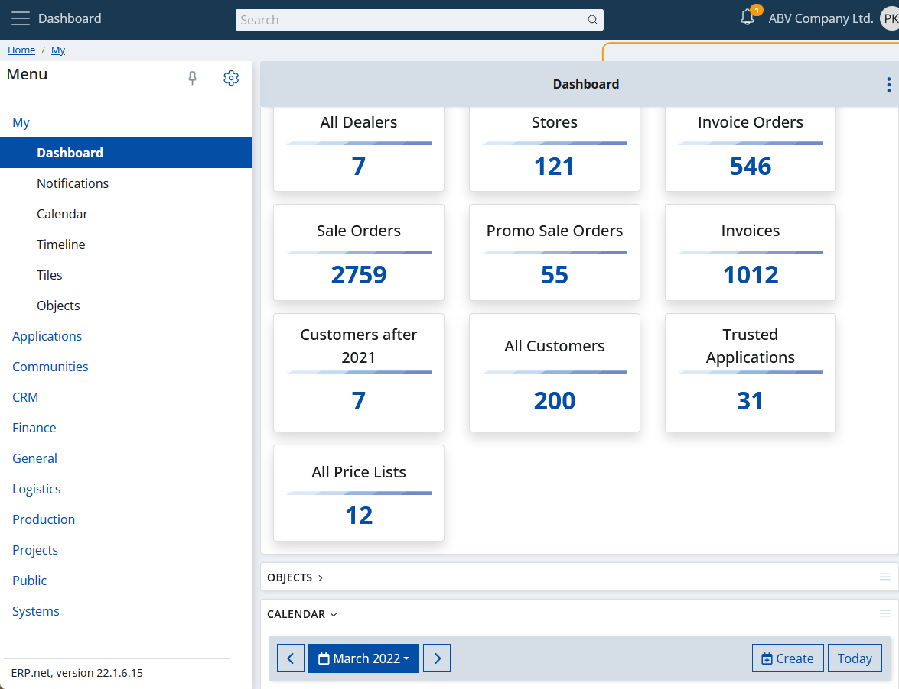

# Overview

The "My Dashboard" is a specific app that is the only one that can't be a widget. This is because the dashboard itself only hosts another apps (in separate panels, i.e. widgets). The main goal is to have all the widgets you need, easily accessible at the moment- with a single click.

You can also have multiple dashboards, thanks to the layout system. This way you can create different dashboards in appearance and content and switch between them, depending on the use case you need.

