# Documents

**My Documents** is an application dedicated to organizing all @@name documents with which you are somehow involved.  

These could be the ones you created and assigned to yourself, along with those which your colleagues created and assigned to you afterwards.  

Apart from offering **instant access** to each document, the application gives you various ways of **customizing** how they are displayed.  

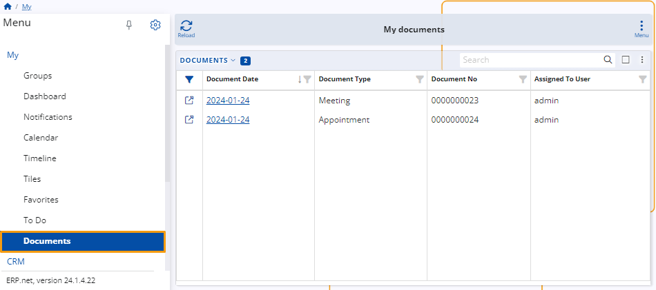

You no longer need to search across different modules and dozens of system navigators in order to find the document that you need.  

In **My Documents**, they are all conveniently unified in one place.  

### Important prerequisites

Upon creation, all @@name documents have an **Assigned To User** field that determines the person whose personalized environment they appear in.  

By default, new documents are automatically assigned to the person creating them (e.g. you). 
You also have the option to assign them to someone else.  

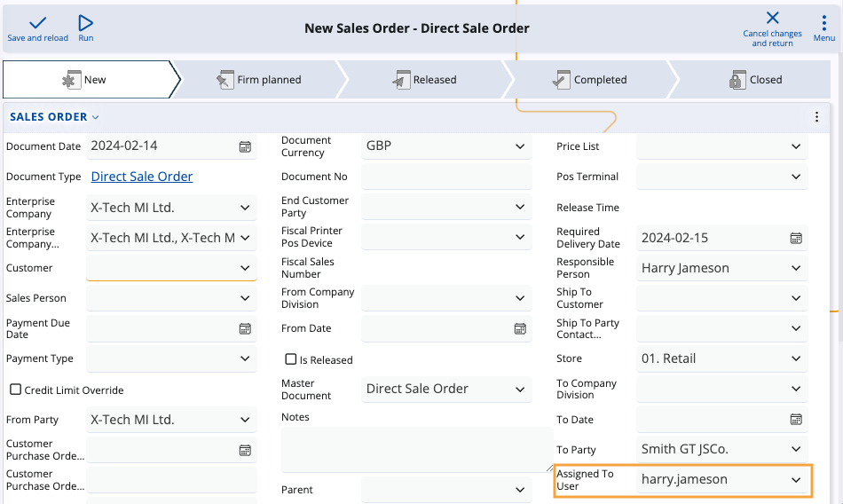

> [!Note]
> **1.** Currently, you always provide the **login** of the user (as defined in **Setup -> Security -> Users**), and not their actual name.  
> 
> **2.** If the **Assigned To User** field is not visible, you need to reveal it manually by **customizing** the document creation panel. 
> This will enable you to **change the person** the document is assigned to.  
> 
> **3.** Once a user is specified and the document is saved, it will appear in the user's respective **My Documents** environment.  

## Features

You can take advantage of various buttons, fields, customization features, and menus to better navigate and organize your documents.

### Documents table

At the very center of **My Documents** is a table presenting all the documents which are somehow related to your account.

You can not only **preview**, but also **interact** with this table, starting from simple operations, such as **filtering**, **sorting**, and **accessing your documents**.  

The app also empowers users to go to more advanced options like **grouping documents by column headers** and **displaying summarized data** about the documents.  

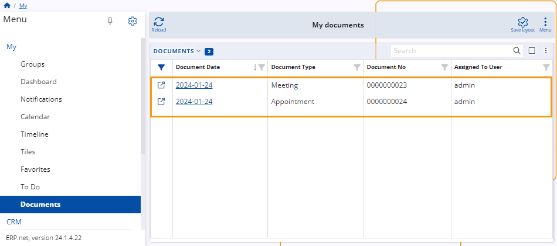

### Search

There's a search bar above the table allowing you to find a specific document.

Simply provide a detail related to it, like its **number**, **date**, or the **type of document** you are looking for - a meeting, appointment, offer, sales order, etc.

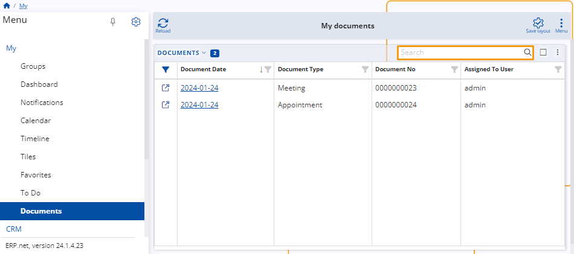

### Actions menu

You can click the vertical **three-dot button** to expand a menu containing a list of actions.

It allows you to perform a wide variety of operations, such as **reloading** your records, **exporting** the table with its data, and even **grouping** your documents by one or more parameters.

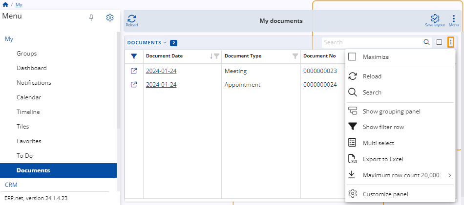

## Show grouping panel

You can use the **Show grouping panel** feature to arrange your documents in groups based on a certain **parameter**, visualized by its respective **column header**.

For instance, you may want to separate the full list of your existing documents in several groups. 
These groups could organize documents by the month they were created, the number they were assigned, their type, and so on.

To begin, click on **Show grouping panel**, then **drag and drop** a column header right into the field that appears above the table.

Once you do that, the documents will be arranged based on that column (e.g. Document Type). 

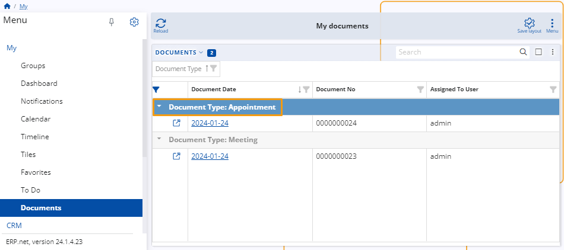

If needed, you can continue to group your documents by providing **multiple** column headers.

In that case, the documents will be further categorized based on which column goes first and what order all the others follow next.

By adding more groups, you configure the table to visualize the documents in a more structured and completely unique way.

If you add a **Document Type** column header first, then a **Document Date** column header second, your documents will first be grouped by their types and then additionally based on the date they were issued on.

## Panel customization

Like most **My** apps, the **Documents** application can be freely customized to your preferences. 

Simply click the **Customize panel** option from the **three-dot** actions menu. This will open a window with two tabs: 

**Items**

You can **hide** or **reveal** columns in the documents table from the **System** section of this tab. 

Toggle the **slider** button next to the desired column to trigger the respective action.

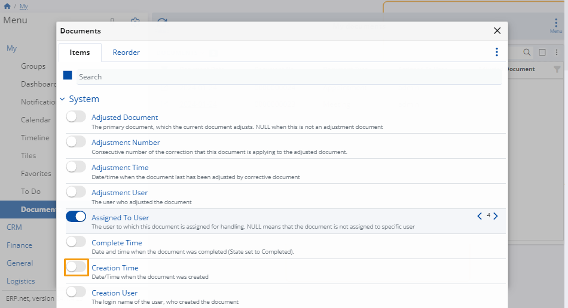
  
**Reorder**

You can **change** the order of the table column headers to better fit your preferences.

Drag them up and down until they form the desired hierarchy.

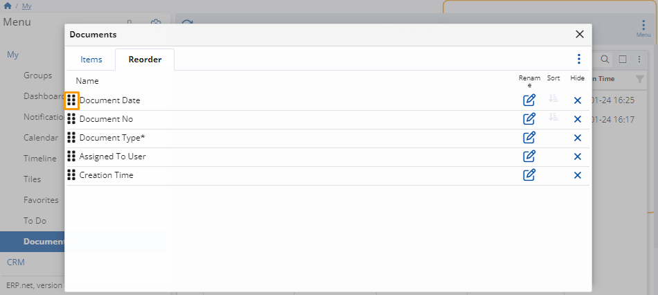

**NOTE!** 

You can reorder your columns by dragging and dropping them across the table itself.

## Menu

There's an additional Menu **button** that allows you to interact with the entire **My Documents** application.

You can take advantage of more global features, such as opening **side panels**, adding **widgets**, creating different **tiles** and showing them **multiple times**.

### Side panels

These can provide invaluable information for each of your documents, as well as allow you to apply additional **filters** to the table.

For instance, you can include a **Details** panel to display additional information about each of your documents.

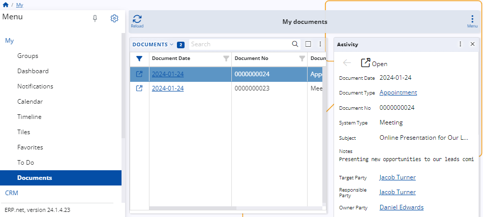

Having the **Document flow** panel at your disposal, on the other hand, gives you direct access to all documents related to the current one.

If a document is released as part of another, the entire chain will show up here.

### Tiles

You can save a specific configuration of the **My documents** page and create a **tile** for it.

Whenever you visit the your personalized **[Tiles](https://docs.erp.net/webclient/introduction/my-apps/tiles.html)** environment, the respective **Documents** tile will be available to access directly from there.

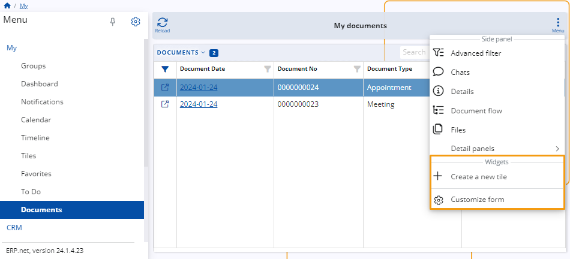

### Customize form

Last but not least, you can **customize** the look and feel of your **Documents** application.

Simply select **Customize form** from the **Menu** dropdown.

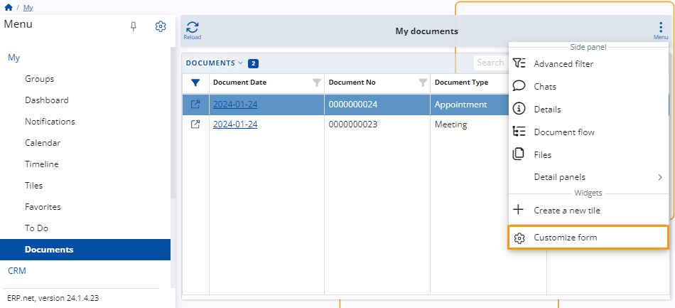

A window with two tabs will open:

**Items**

Here, you can **hide** or **reveal** certain panels, widgets and items from the main page.

Toggle their sliders **off** or **on**, respectively, to achieve the desired action.
    
It is here that you can also include additional widget panels dedicated to your **favorite** documents, document-related **tiles** and different **web views**.
    

    
You can include up to **five** tile panels in your **Documents** application.

This allows you to have readily available configurations which can **alter** the appearance of the page when clicked, based on the filters and grouping configurations applied.

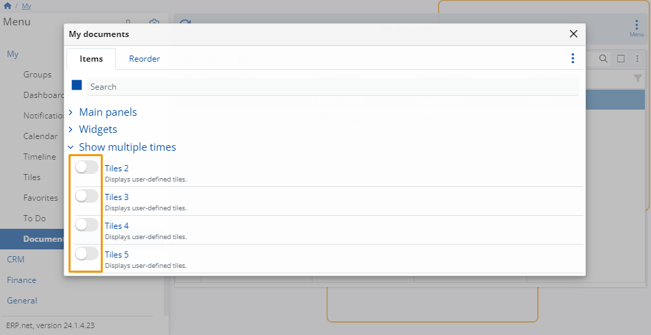
    
**Reorder**

You can change the order of the items on the page by dragging them up and down until they form the desired hierarchy.

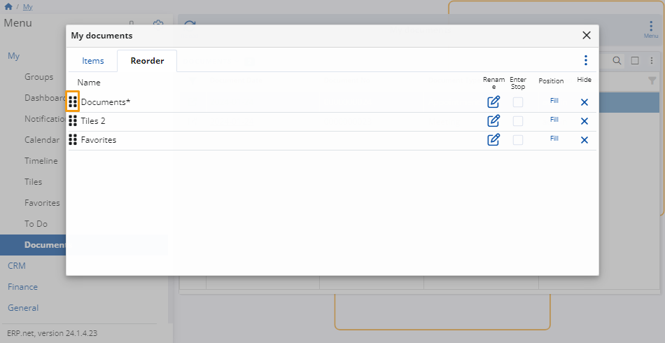
