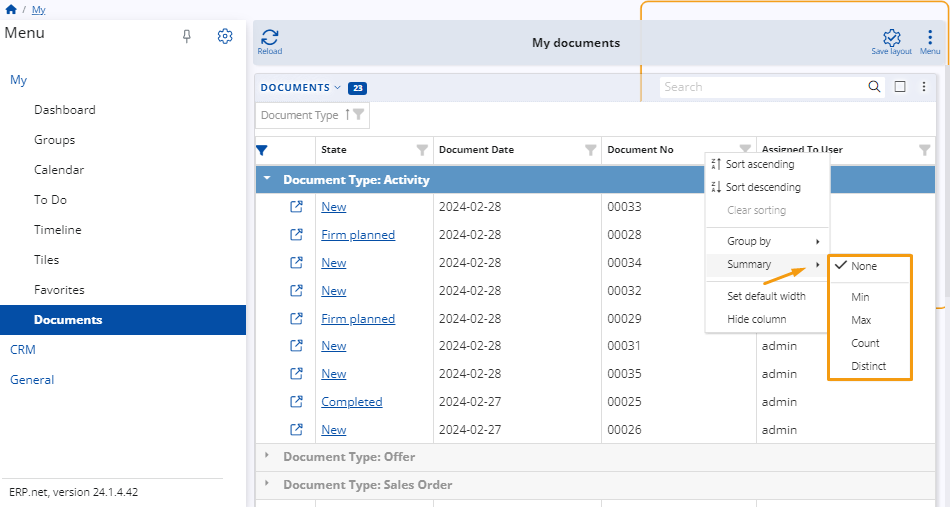
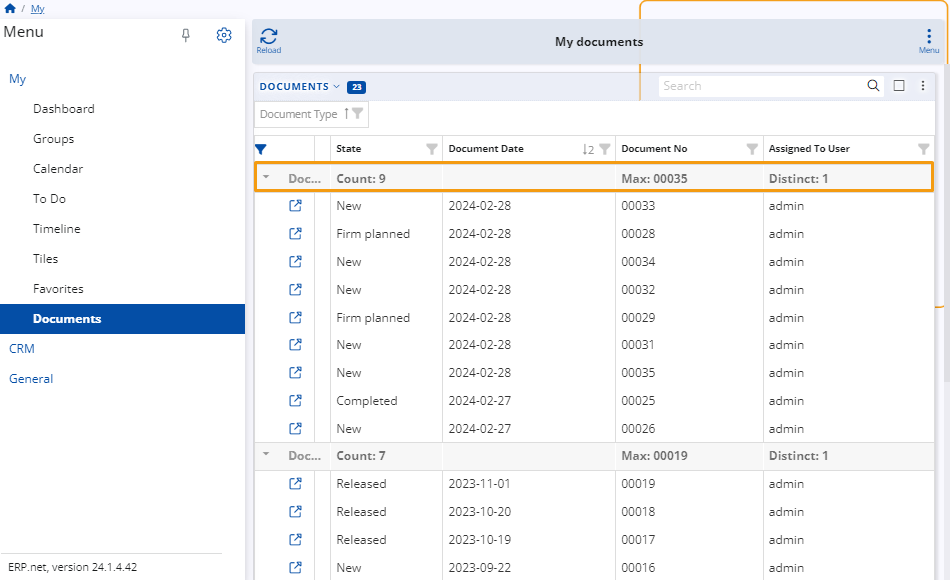

# Documents

**My Documents** is an application dedicated to organizing all documents in @@name which **you are somehow involved with**.  

These could be the ones you created and assigned to yourself, along with those which your colleagues created and assigned to you afterwards.  

Apart from offering **instant access** to each document, the application gives you various ways of **customizing** how they are displayed.  

You no longer need to search across different modules and dozens of system navigators in order to find the document that you need.  

In **My Documents**, they are all conveniently **unified** in one place.  

### Important prerequisites

Upon creation, all @@name documents have an **Assigned To User** field that determines the person whose personalized environment they appear in.  

By default, new documents are automatically assigned to the **person creating them** (e.g. you). 
You also have the option to assign them to **someone else**.  

> [!Note]
> 1. Currently, you always provide the **login** of the user (as defined in **Setup -> Security -> Users**), and not their actual name.  
> 
> 2. If the **Assigned To User** field is not visible, you need to reveal it manually by **customizing** the document creation panel. 
> This will enable you to change the **person** the document is assigned to.  
> 
> 3. Once a user is specified and the document is saved, it will appear in the user's respective **My Documents** environment.  

## Features

You can take advantage of various buttons, fields, customization features, and menus to better navigate and organize your documents.  

### Documents table

At the very center of **My Documents** is a table presenting all the documents which are somehow related to your account.  

You can not only **preview**, but also **interact** with this table, starting from simple operations, such as **filtering**, **sorting**, and **accessing** your documents.  

The app also empowers users to go to more advanced options like grouping documents by **column headers** and displaying **summarized data** about the documents.  

### Search

The **search bar** above the table is intended to help you find a specific document.

Simply provide a detail related to it, like its **number**, **date**, or the **type** of document you are looking for - a meeting, appointment, offer, sales order, etc.  

The search will return a list of all the documents that contain the **detail** you searched for.  

### Actions menu

You can click the vertical **three-dot button** to expand a menu containing a list of **actions**.  

It allows you to perform a wide variety of operations, such as **reloading** your records, **exporting** the table with its data, and even **grouping** your documents by one or more parameters.  

## Show grouping panel

You can use the **Show grouping panel** feature to arrange your documents in groups based on a certain **parameter**, visualized by its respective **column header**.

For instance, you may want to separate the full list of your existing documents into several groups. 
These groups could organize documents by their **type**, **state**, the **month** they were created on, and so on.  

To begin, click on the **Show grouping panel**, then **drag and drop** a column header right into the field (space) that appears above the table.  

Once you do that, the documents will be arranged in **groups** based on that column (e.g. Document Type).  

Documents having the same value determined by a column header will appear under it.  

You can also group your documents in a multi-level, hierarchical order by providing **multiple column headers**.  

In that case, the documents will be further categorized in groups based on the column that was placed first, followed by the rest of the grouped columns in a consecutive order.  

By adding more groups, you configure the table to visualize the documents in a more structured and navigation-friendly way.  

For example, let's say you add a **Document Type** column header first, then a **Document Date** column header second:  

1. **Two** levels of groups will show up.  
2. The **first-level groups** will indicate what **type** of documents each of them contains - for example, activities, offers, sales orders, etc.  
3. The **second-level groups** will further narrow the range of documents down to **the date** they were issued on - for example, only the offers issued for a specific year, month, or date.  

> [!Tip]
> 
> You can gain insights into your data from different points of view by changing the column headers that you group or simply by switching their order.  

### Summary

You can gather useful statistical information about each column by taking advantage of My Documents' Sumamary feature.

Summary allows you to narrow down your documents to just the ones containing a specific value in them, or the ones containing entirely unique values.  

Simply **right-click** on a column header and select **Summary** from the menu. This will open a list of available **functions**.

* **Count** - It calculates the number of documents where a specific value in a field is present.
* **Distinct** - It counts all the unique values within a field in the current navigator form.
* For fields with a **number data type**, you can see other details such as **Max** or **Min** values.

## Panel customization

Like most **My** apps, the **Documents** application can be freely customized to your preferences.  

Simply click the **Customize panel** option from the **three-dot** actions menu found at the top-right corner of the table. 

This will open a window with two tabs: 

**Items**

You can **hide** or **reveal** columns in the documents table from the **System** section of this tab.  

Toggle the **slider** button next to the desired column to trigger the respective action.  

  
**Reorder**

You can **change** the order of the table column headers to better fit your preferences.  

Drag them up and down until they form the desired sequence.  

> [!NOTE]  
> You can also reorder your columns by dragging and dropping them horizontally across the table itself.  

## Menu

There's an additional **Menu** **button** in the ribbon above the table that allows you to interact with the entire **My Documents** application.  

You can take advantage of more global features, such as opening **detail panels**, adding **widgets**, creating different **tiles**, and showing them **multiple times**.  

#### Detail panels

These can provide invaluable information for each of your documents, as well as allow you to apply additional **filters** to the table.  

For instance, you can add a **Detail panel** to view additional information about each of your documents.  

This enables you to preview the document's data in a fast and easy way, without even having to open the document's form.  

> [!Tip]  
> Each **Detail panel** will visualize data for the respective document as soon as you select its row.
> 
> You can **rapidly preview** the data of a number of documents - simply **switch** between the rows of the primary table when ready.  

Oftentimes, a document is issued as part of a sequence of documents, called a **document chain**.  

Having the **Document flow** panel at your disposal gives you an easy way to traverse the whole document chain and quickly access all documents related to the current one.  

If a document is released as part of other documents, the entire chain will show up here.  

### Tiles

You can save a specific configuration of the **My documents** page and create a **tile** for it.  

In case you have set a combination of filters, the tile will store them as well.  

Whenever you visit your personalized **[Tiles](https://docs.erp.net/webclient/introduction/my-apps/tiles.html)** environment, the respective **Documents** tile will be available to access directly from there.

### Customize form

Last but not least, you can **customize** the look and feel of your **Documents** application.

Simply select **Customize form** from the **Menu** button's dropdown.

A window with two tabs will open:

**Items**

Here, you can **hide** or **reveal** certain panels, widgets, and items from the main page.

Toggle their sliders **off** or **on**, respectively, to achieve the desired action.
    
It is here that you can also include additional widget panels dedicated to your **favorite** documents, document-related **tiles**, and different **web views**.
    

    
You can include up to **five** tile panels in your **Documents** application.

This allows you to have readily available configurations which can **alter** the appearance of the page when clicked, based on the filters and grouping configurations applied.

    
**Reorder**

You can change the order of the items on the page by dragging them up and down until they form the desired layout.  

Use the **Position** option to determine how each of the item panels you want to visualize.  

You can select between a **Fill**, **Left**, or **Right** position to neatly order your panels and make the best use of your screen space.  
