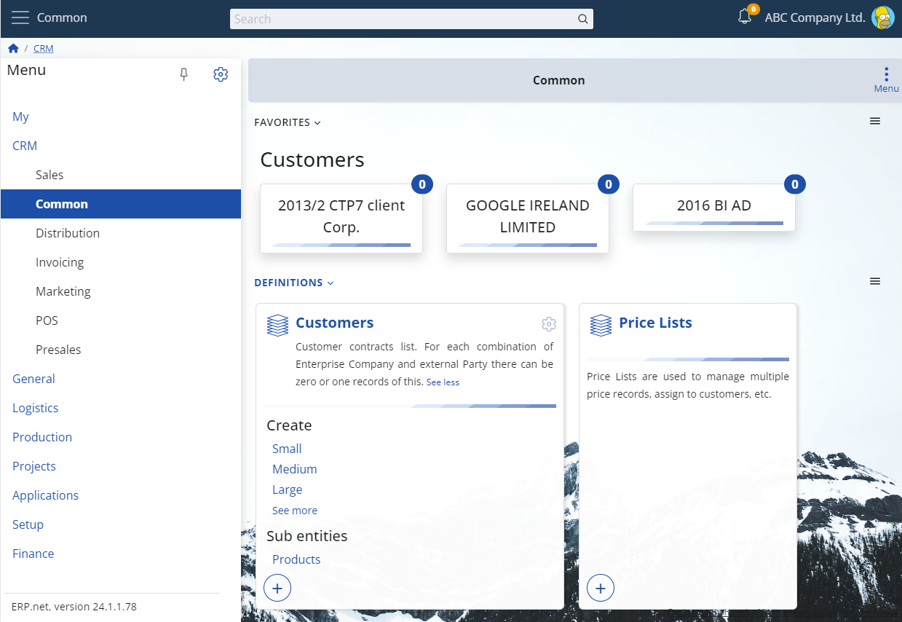
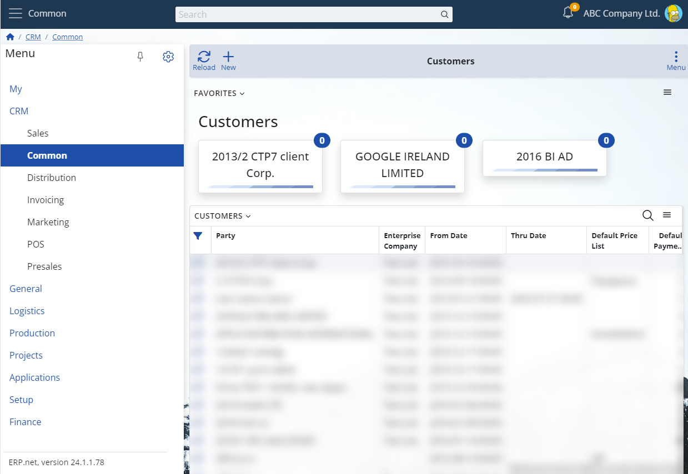

# Overview of Favorites

"My Favorites" provides a visual representation of special objects that [you are following](../../social/social-follows.md), also known as your favorite objects (i.e. objects with **Follow level = Favorite**). Much like [My Tiles](../tiles.md), the main visual element here is the tile, although with some differences. The caption of the tile is the [display text](https://docs.erp.net/tech/advanced/data-objects/display-format.html) of the favorite object, and the badge displays the count of available new notifications.

Consequently, an example of the overall view of "My Favorites" looks like this:

Favorites are represented as tiles. The tiles are organized into groups based on the entities they belong to. Each tile shows:
- the object’s display text, and
- a badge with the count of new notifications for that object (when available).

Additionally, clicking on a tile will open the form for the favorite object.

[!NOTE]
> After the update that introduced follow levels, **all existing follows are migrated to level “Tagged”** by default.  
> As a result, users may initially see an empty Favorites app until they mark objects as **Favorite**.

## Getting Started

### Add an object to Favorites

To add an object to Favorites, set its follow level to **Favorite**.

1. Open the object in Web Client.
2. Use the **follow (star) button** in the form header (or from the context menu).
3. Click until the object becomes **Favorite**.

OR you can skip this cycle by pressing Ctrl+Mouse click on the star icon.

For details about follow levels, see:  
[Social follows](../../social/social-follows.html).

### Open a favorite object

1. Open **Favorites**.
2. Click a tile to open the form of that object.

### Remove an object from Favorites

1. Open the object.
2. Change its follow state away from **Favorite** (e.g. Unfollow).
Additionaly you can press Shift+Mouse click on the star icon to unfollow 

## Concepts

### What is shown in Favorites

Favorites lists **only** objects with **Follow level = Favorite**.

Objects that are - **Tagged** (automatic follow), or- **Following** do **not** appear in Favorites.

A user can have **up to 50 favorite objects**. If you reach the limit, you must remove an existing favorite before adding a new one.

### Tiles and notifications badge

- A tile caption is the object’s display text.
- The badge shows the number of new notifications for that object (when available).
- Even if an object currently has no new notifications, its tile remains visible as long as the object stays in Favorites.

## Favorites as a widget

Similar to most My Apps widgets, Favorites supports the following behavior:

- You can show the Favorites widget in forms of your choice.
- Only favorite objects related to the form’s context are shown.

## My Favorites as a widget

Similar to most My Apps widgets, "My Favorites" supports the following properties:

- You can show the favorites widget in each form of your choice.
- Only the favorite objects (i.e., the tiles) related to the form's context will be shown.

Below, you can see example images illustrating the favorites widget on a menu page and within a navigator form.

