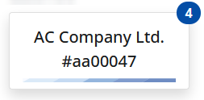

# Favorites

"My Favorites" provides a visual representation of all objects that [you are following](../../social/social-follows.md), also known as your favorite objects. Much like [My Tiles](../tiles.md), the main visual element here is the tile, although with some differences. The caption of the tile is the [display text](https://docs.erp.net/tech/advanced/data-objects/display-format.html) of the favorite object, and the badge displays the count of available new notifications.

Consequently, an example of the overall view of "My Favorites" looks like this:

The tiles are organized into groups based on the entities they belong to.

Additionally, clicking on a tile will open the form for the favorite object.

> [!NOTE]
> Even if you have no notifications for a favorite object, its corresponding tile will still be displayed. The tile will disappear once you remove the object from your favorites.

## My Favorites as a widget

Similar to most My Apps widgets, "My Favorites" supports the following properties:

- You can show the favorites widget in each form of your choice.
- Only the favorite objects (i.e., the tiles) related to the form's context will be shown.

Below, you can see example images illustrating the favorites widget on a menu page and within a navigator form.

