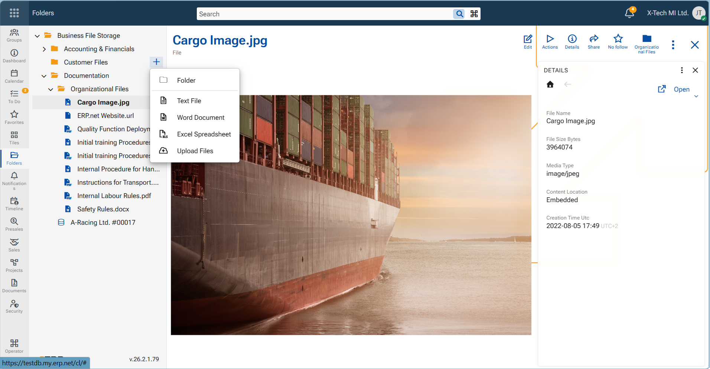

# My Folders in @@webclient

"My Folders" is the file management application in the ERP.net Web Client. It provides a structured workspace for storing and organizing files related to business processes and ERP records.

The application follows the familiar concept of a desktop file explorer. Files are organized in folders and subfolders arranged in a hierarchical tree structure, allowing users to group related documents and navigate through them easily. Read more about the concept of [File management](https://info.erp.net/features/general/file-manager.html) in ERP.net.

Through My Folders, users can manage corporate documents directly within ERP.net. Files can be uploaded, stored, edited, renamed, moved, or deleted, while folders can be created and organized to reflect the company’s internal structure or working processes. This allows employees to access and manage documents without relying on external storage systems or switching between multiple applications.

The Folders application also acts as a central location for files attached to ERP records. Documents related to specific business entities—such as products, projects, or transactions—can be organized within folders and accessed directly from the ERP environment.

By providing a familiar folder-based structure, the application simplifies document organization and retrieval. Users can browse files through the folder hierarchy, perform common file management operations, and maintain a clear structure for corporate documents within the system.

## What the Folders application enables

- Organizing files in a hierarchical folder structure

- Uploading and storing documents within ERP.net

- Managing files through common operations such as rename, move, delete, and edit

- Structuring documents related to ERP records and business processes

- Accessing and maintaining corporate files directly within the ERP environment

> [!NOTE]
> - Supported file types include: text documents, spreadsheets, PDFs, images, videos, archives, URLs. 
> - Supported file formats include: .PDF,   .doc,  .xlsx,  .jpg / .png / .bmp,  .txt,  .zip,  .mp4.  
> - Maximum file size for upload is 50 MB. In chat discussions an attached file may not exceed 5 MB. 
> - Files and Folders are by default sorted in alphabetical order, folders going first.

## Interface overview

When the My Folders application is opened, the workspace is organized into two main areas that allow users to browse and manage files efficiently.

- Folder tree (left panel, navigation)  
The left panel displays the hierarchical structure of folders created in the system. Folders can contain subfolders and files, forming a tree structure similar to common desktop file explorers. Expanding a folder reveals its contents in the tree, allowing users to navigate through the folder hierarchy.

- Content panel (central panel)  
Displays the contents of the item selected in the folder tree. When a folder is selected, the panel shows the files stored in that folder. When a file is selected, its content is displayed in the panel, allowing users to review the document directly within the application.

- Side panel (right panel)  
It gives additional information about the file. The side panels are content dependent - Discuss panel, To-Dos panel, Notifications etc.

- Creating new items  
When hovering over a folder in the tree, a + icon appears next to it. This action allows users to create new items within the selected folder, such as subfolders or files.

- Context menu  
Additional actions are available through a context menu that appears when right-clicking a folder or file. The menu provides options for common file management operations related to the selected item.

