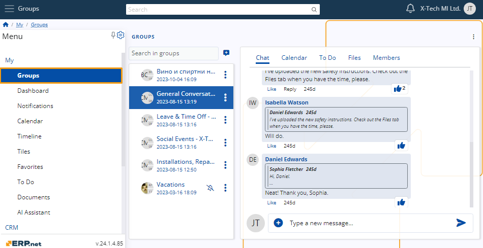
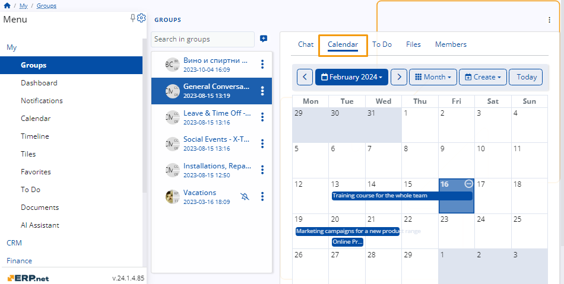

# Social Groups 

**My Groups** is a centralized all-in-one application uniting team collaboration with personal productivity.

It allows you to:

* easily communicate with your colleagues
* attend and schedule group meetings
* complete and assign tasks
* preview, download and upload file attachments
* manage group members
* ...and much more.

  

## Structure

Every group consists of five tabs, each of which is tailored to the group and its participants.

Depending on the **[role](roles.md)** of a member, access to these tabs may be limited.

### Chat 

The **Chat** enables swift communication between group participants. 

For most members, it includes industry-standard features like the ability to preview and send messages, react and reply to others, and even edit one's own message.

## Calendar 

The **Calendar** allows members with the necessary permission levels to create and see various events and meetings that will be visible to the whole group.

If you create or are involved in a group activity as a participant, it will appear **[in your own personal Calendar](./my-apps/calendar.md)** as well.

## To Do

The **To Do** tab displays all tasks assigned to you and other group members and lets you complete the ones that are ready. 

As long as you have Member or Admin permissions, you can also create new tasks and delegate them to others.

If you add or are assigned a to-do, it will appear **in your own personal To Do environment** as well.

## Files

In the **Files** tab, you can access file attachments uploaded by you or other group members.

You can see information about each file's format, the name of its author, as well as the date and time it was uploaded.

## Members

The final **Members** tab houses all members of the current group, together with their **[roles](roles.md)**.

**Admins** reserve the exclusive ability to create and remove participants, as well as change their permission levels on-demand.

