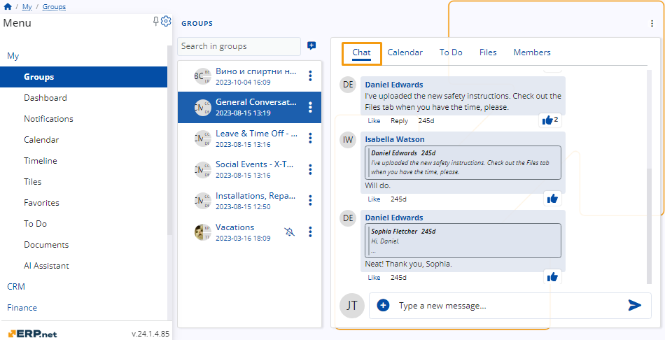
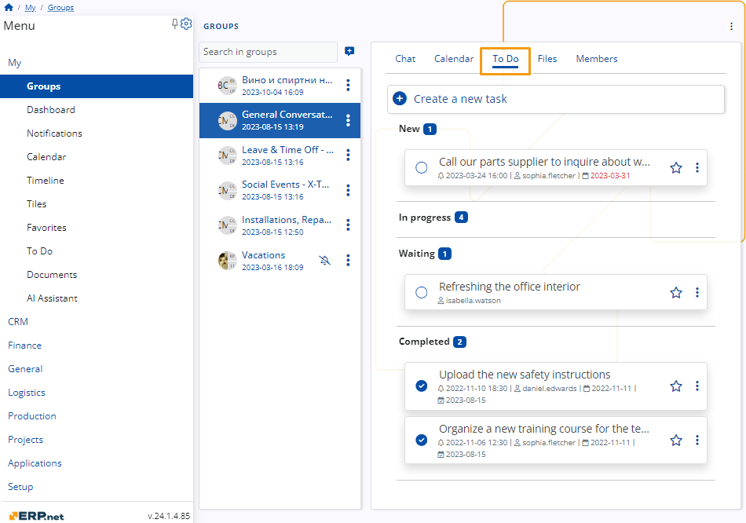
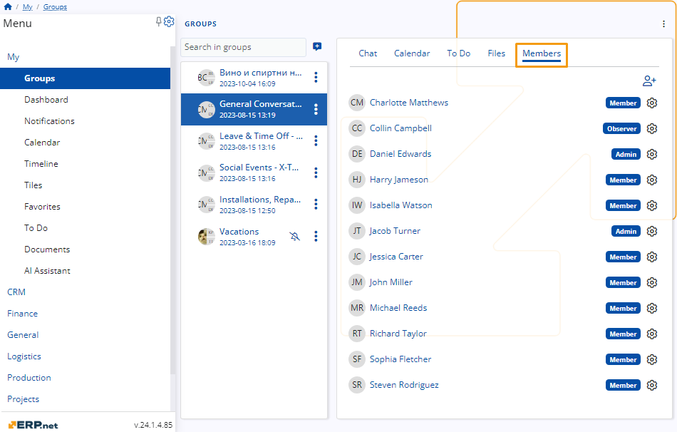

# Social Groups 

The **ERP.net's** **Groups** is a tool for enhancing team collaboration and productivity. 

With **Groups**, you can seamlessly unite your team members, tools, and information in one centralized digital workspace.

## Navigation 

You can find Groups in the **My** section of the **Menu**. 

  

## Chat 

In every group, there exists a chat function enabling communication among members who have the necessary permissions. 

This chat includes standard features such as sending messages, liking them, and replying to messages.

## Calendar 

In the **Calendar** feature, you can create and see various events for yourself and other group members. 

These events encompass:
- Meetings
- Tasks
- Sick Leave
- Leave
- Calls
- Demonstrations
- Appointments

## To Do

In the **To Do** tab, you can create and view tasks assigned to yourself and other group members. 

Tasks are organized based on their status, which include:
- New
- In Progress
- Waiting
- Completed

## Files

In the **Files** tab, users can access files uploaded by themselves or other group members. Additionally, they can upload new files as needed. 

Each file displays information about its format, and uploader, as well as the date and time of upload.

## Members

In the **Members** tab, users have visibility of all members within the group and can add new members when necessary. 

If you have **admin privileges**, you can also assign different roles to yourself and other members directly from this tab.

