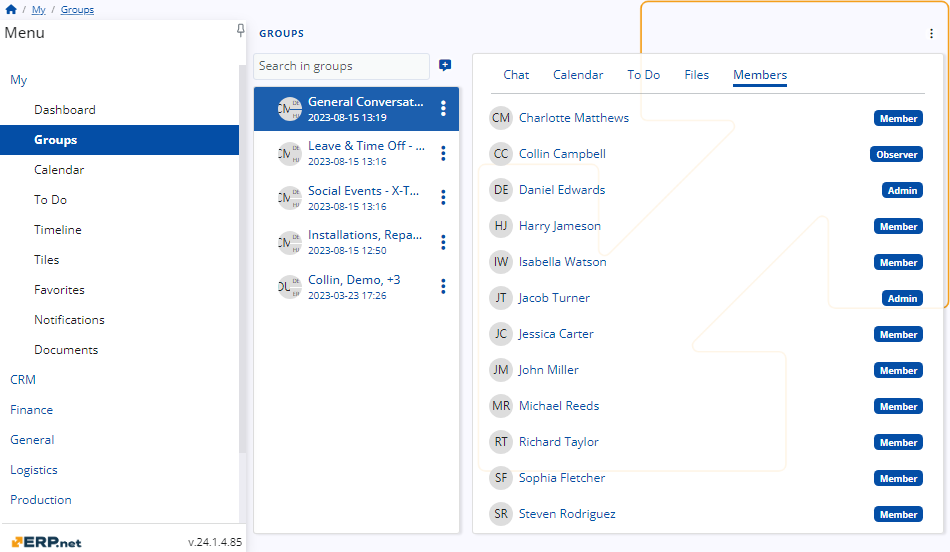

# Roles 

Groups within **ERP.net** serve as a convenient communication platform within a company. 

To streamline user access and ensure efficiency, roles are assigned within these groups to allocate rights appropriately. 

This allows users to access only the functionalities relevant to their roles, enhancing productivity and security within the system.

## General Responsibilities 

In each group within **ERP.net**, predefined social roles are assigned, with fixed capabilities that cannot be customized. 

To grant a user additional capabilities, they must be promoted to a different role, but these capabilities cannot be tailored.

It's crucial to assign roles carefully to prevent users from abusing their permissions and ensure the integrity of the system.

### Admin Role

The admin role possesses every capability available on the platform in the [**Group**](https://docs.erp.net/webclient/introduction/my-apps/groups/index.html) section.

This role is the only one with the authority to add members to the group or change their roles, including the demotion of another admin or yourself. 

Each group must have at least one admin. 

Therefore, if you are the sole admin remaining, you cannot demote yourself, ensuring the continuity of administrative functions within the group.

Here is information regarding the abilities of the admin in each tab:
- **Chat:** Admins can write messages, like messages, and reply to messages in every chat in their groups.
- **Calendar:** Admins can view the calendar and also create events of any kind for everyone in the group.
- **To Do:** Admins can see the tasks in the To Do tab, set their status, and create new ones.
- **Files:** Admins can view and download files and can also upload files of their own.
- **Members:** Admins can see all group members and their roles and are the only members able to add a member or change their statuses.

   

### Member role

Members of a group possess all the capabilities of the admin role except for the ability to add members to the group or change their roles.

Here is information regarding the abilities of the member in each tab:
- **Chat:** Members can write messages, like messages, and reply to messages in every chat in their groups.
- **Calendar:** Members can view the calendar and also create events of any kind for everyone in the group.
- **To Do:** Members can see the tasks in the To Do tab, set their status, and create new ones.
- **Files:** Members can view and download files and can also upload files of their own.
- **Members:** Members can see all group members and their roles but they can’t add a member or change their statuses.

   

### Observer Role

An observer is a user with limited capabilities within the group. They can only view activities but cannot write, answer, create, or add anything.

Here is information regarding the abilities of the observer in each tab:
- **Chat -** Observers can view the chat for every group they are in and like messages, but they are unable to write or answer.
- **Calendar -** Observers can only view the calendar; they cannot create events of any kind.
- **To Do -** Observers can see the tasks in the To Do tab and set their status, but they cannot create new tasks.
- **Files -** Observers can view and download files but cannot upload files.
- **Members -** Observers can see all group members and their roles but are unable to perform any actions within that tab.

   
