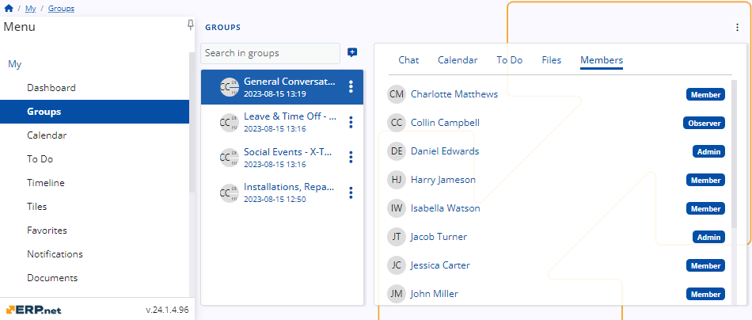

# Roles 

To streamline user access and ensure efficiency, **roles** are assigned to all members within a group as soon as they are added to it.

This allows them to access only the functionalities relevant to them at the moment, preventing potential mishaps and unwanted actions.

## General responsibilities 

Every social group in **ERP.net** comes with three predefined roles for user assignment, each having fixed permission levels that cannot be customized. 

   

If users with limited access need to get a broader range of capabilities, they must be promoted to a role offering extra features.

Similarly, in case a member needs to get demoted, they can be assigned a role that prevents them from performing a certain set of actions.

> [!NOTE]
>
> Roles can be delegated and subsequently changed **only** by the group's Admin(s). 

### Admin

The Admin role grants users every capability available in the five [**My Group**](https://docs.erp.net/webclient/introduction/my-apps/groups/index.html) tabs.

This role is also the only one with the authority to **add** new members to the group, **remove** existing ones, and **change** member roles, including that of yourself or another admin.

> [!WARNING]
>
> Each group must have **at least one** admin.

**Chat** 

Admins can preview existing chat messages, write new ones, react and reply to other members' messages, as well as edit their own.

**Calendar**

Admins can view activities in the group Calendar, as well as create and schedule activities of any kind.

**To Do**

Admins can see and complete to-do tasks, as well as create new ones and assign them to others.

**Files**

Admins can view and download file attachments, and also upload new ones.

**Members**

Admins can preview all group members and their roles. 

They reserve the exclusive ability to add and remove members, as well as delegate and change their roles.

   

### Member

The Member role features all the capabilities of the Admin role. 

However, members **cannot** add and remove other members, as well as delegate and change their roles.

Therefore, the only noticeable difference for them is the absence of certain buttons and features in the **Members** tab of the group.

   

### Observer

The Observer role offers **limited** capabilities within a social group, featuring primarily read-only actions. 

It is ideal for members who do not need to actively interact with the group but still get to be part of it.

**Chat** 

Observers can preview and react to existing chat messages but are unable to write new ones or reply to others.

**Calendar**

Observers can view activities within the group Calendar but cannot create activities of any kind.

**To Do** 

Observers can see and complete to-do tasks but cannot create new ones and assign them to others.

**Files** 

Observers can only view and download file attachments.

**Members**

Observers can only preview group members and their roles.

   
