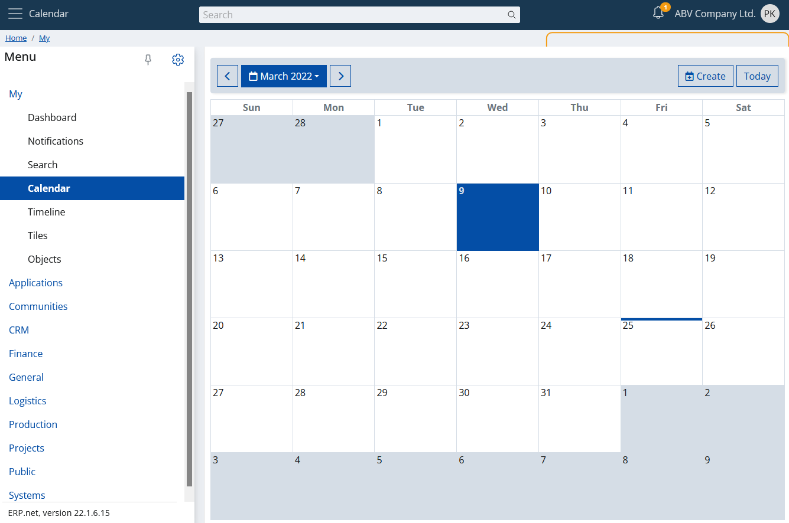
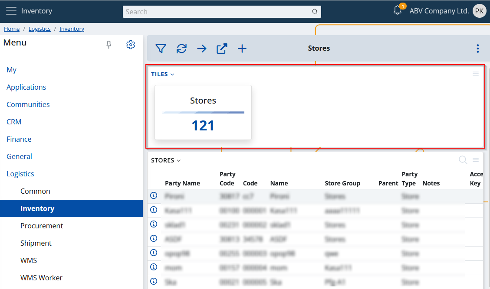

# Overview

My apps is a generic name for a special kind of functionality in @@webclient. These are interactive applications that can "live independently"- i.e., you can use them as standalone apps. In most cases, they present aggregated or more complex data in a convenient way. My apps are directly related and are also a key extension of the [Social ERP concept](../social/index.md). They can be accessed through their section in the main menu.

A classic example of one "My app" is the calendar. It's a standalone application that visualizes a calendar, taking up the entire page.

Of course, this is not just a calendar :) You can read more about it in [the separate topic](./calendar.md). 

# Widgets

A specific feature of each My App is that it can be visualized not only independently, as given above, but also in its own [panel](../terms.md#panel).

> [!NOTE]
> Panels that host My apps are called widget panels or simply widgets.

So what do you think you can do with widget panels? You can visualize them **anywhere**. Yes, literally everywhere. In any form in @@webclient. What's more, they are smart - ie. they take into account the context in which they are displayed and show only relevant content.

See, for example, My Tiles. How much information it displays in its main screen:

And see now what it visualizes if placed in Crm -> Common:

Or even more specifically - Crm -> Common -> Price Lists:

This is the idea - contextual information at your fingertips, easily accessible anywhere.

## Visualizing a widget panel

1. Just go to the form where you want to add it.
2. From the main settings, click "Show/Hide panels".

3. Expand the "Widget Panels" category and just check the ones you want to include.

4. Done.

The widgets in the example were [calendar](./calendar.md) and [tiles](./tiles.md). You can find more information about them, as well as all other widgets, through the menu section on the left.