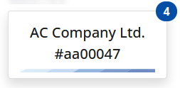
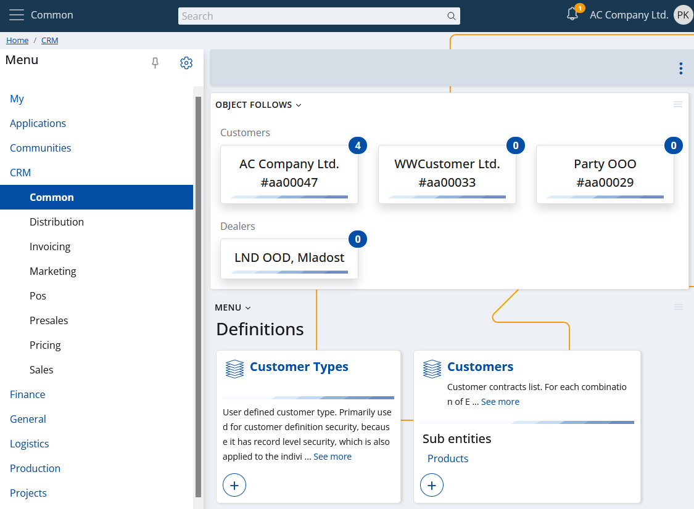

"My Object follows" is the visualization of all objects, followed by you. Or in short your [social follows](../../social/social-follows.md). Like [My Tiles](../tiles.md), the key visual component here is the tile, but it looks a little different. The caption of the tile is the [display text](https://docs.erp.net/tech/advanced/data-objects/display-format.html) of the followed object, and the badge contains the number of your new notifications available.

Accordingly, a sample overall view of "My Object follows" looks like this:

The tiles are grouped according to the entity to which they belong. 

Also, if you click on a tile, the form of the followed object will be opened.

> [!NOTE]
> Although you have no notifications to the object you are following, its corresponding tile will be still displayed. The tile will disappear the moment the object is unfollowed.

## Object follows as a widget

Like most My apps widgets object follows also supports their properties:

- You can show the object follows widget in each form of your choice.
- Only the object follows (i.e. the tiles), related to the form's context will be displayed.

Below you can see example pictures showing the object follows widget on a menu page as well as in a navigator form.

