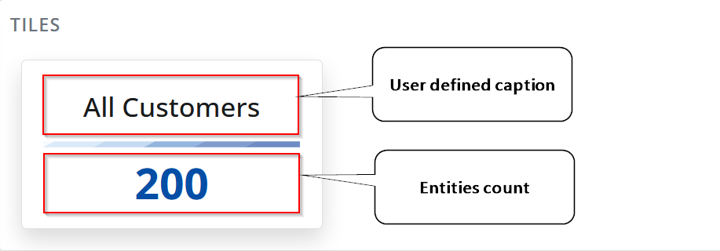
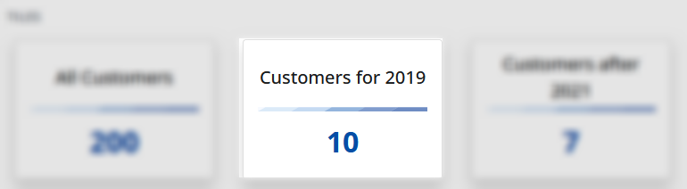
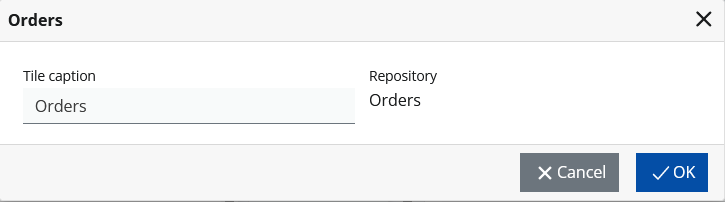
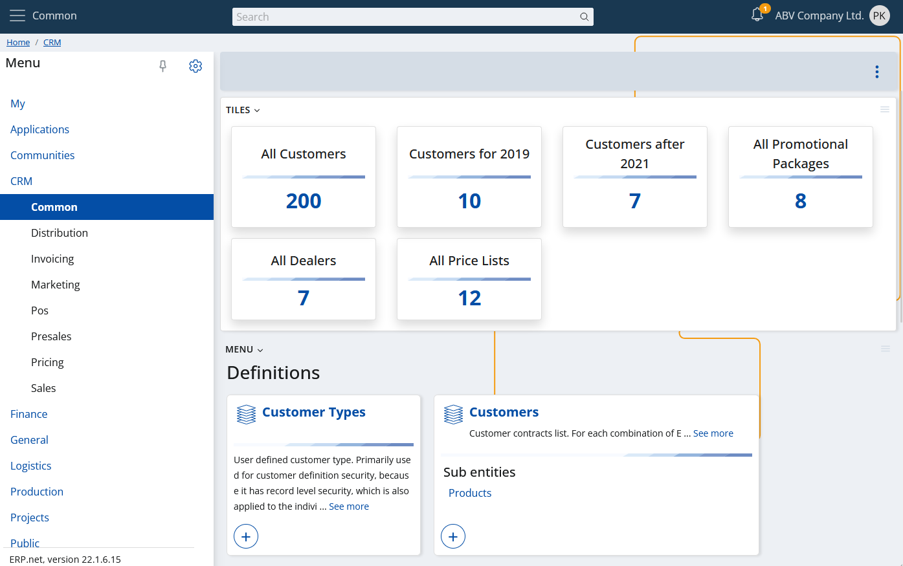

# Overview

"My Tiles" is a specialized app that allows you to see the number of objects for entities of interest to you. E.g., all your customers or all new customers for this year. All products or all products in a specific group, etc...

A sample view of the tiles app. 

## Tile

Each tile is a simple piece of data. It shows just two things- a caption and a number. The title is user-defined, and the number represents the objects count.

Internally, each tile represents an entity (i.e. a repository) and the number it shows is the number of objects in it. 

As you may have noticed in the picture above, there are several tiles representing the same navigator, but the number of objects they show is different. The difference is that some have applied filters.

This is just the [Customers](https://docs.erp.net/model/entities/Crm.Customers.html) navigator, but with an applied filter. `FromDate >= "2019-01-01" and FromDate <= "2020-01-01"`

Additionally, each tile is a link to its navigator with an applied filter (if any). This means that you just need to click it and its corresponding filtered navigator will open. 

## Creating a tile

You can follow the steps below to create a tile:

1. Open a navigator of your choice.

2. If you want some filtering, just apply it.

3. Then open the form's main menu and select "Create a new tile".

4. A dialog will open where you can enter the caption of the new tile.

> [!WARNING]
> The caption of a tile must be unique. If you try to enter a caption that already exists, you will see an error.

5. Done. You will be redirected to "My Tiles" and there you will see your new tile.

## Tiles as a widget

Because the "Tiles app" is a "My apps" member, this means that it can behave as a widget. This automatically means the following:

- You can show it in any form you want (i.e., to "plug" it as a widget panel).
- Will show only the tiles that are part of the host context (e.g., you don't need "Customer" related tiles in "Production").

