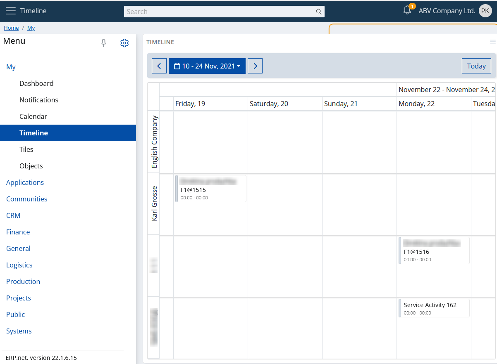

# Overview

As the [calendar application](./calendar.md) "My Timeline" is... a calendar. But in a more sophisticated way. 

The timeline displays not just your activities, but:

- All your mail messages
- Created documents
- Phone calls

...In a timeline.

This is a convenient tool with which you can trace chronologically what happend. The timeline shows 15 days in a row and groups all events, according to the related party.

