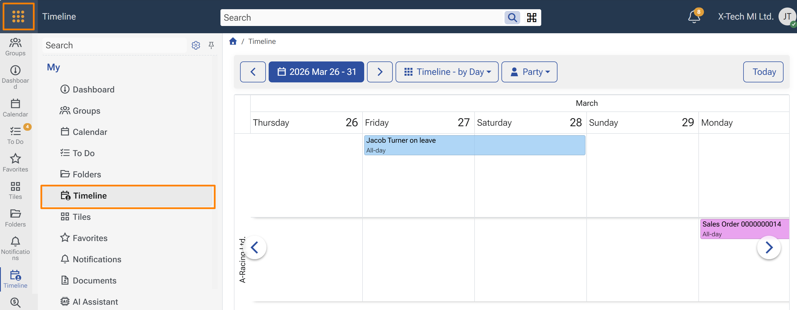
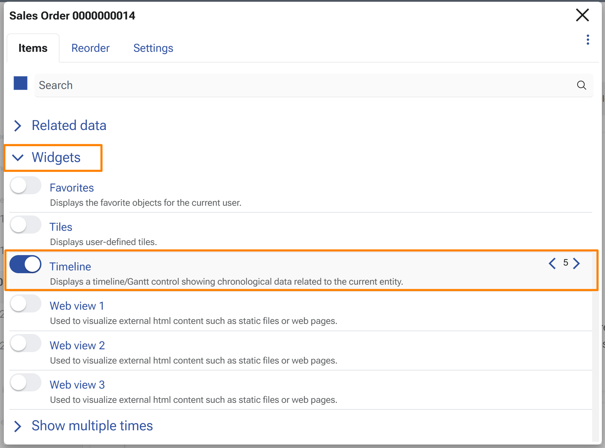
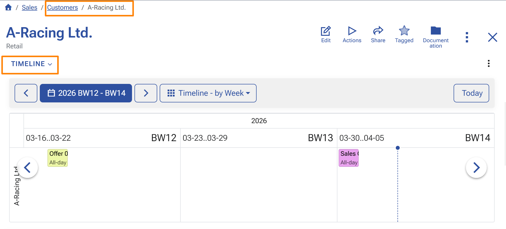

# My @@webclient Timeline

As the [calendar application](./calendar/index.md) "My Timeline" is... a calendar. But in a more sophisticated way. 

The timeline displays not just your activities, but:

- All your mail messages
- Created documents
- Phone calls

...In a timeline.

This is a convenient tool with which you can trace chronologically what happend. The timeline shows 15 days in a row and groups all events, according to the related party.

## 1. Timeline as a widget

Like other My apps, the Timeline can be added to a form as a widget panel.

To show it in a form:

1. Open the target form.
2. Open the form menu.
3. Select **Customize form**.
4. In the **Items** tab, enable **Timeline** from the **Widgets** section.
5. Save the layout.

For more information about adding panels to forms, see [How to customize form in ERP.net Web Client](https://docs.erp.net/webclient/layouts-and-views/guide/customize-form.html).

### Context-aware behavior in forms

When the Timeline is shown inside a form, it uses the **current record as context**.

This means the widget does not show unrelated timeline data. Instead, it refreshes according to the record currently opened in the form.

This is useful when working with records such as:

- customers, suppliers, companies, and persons
- CRM records related to a party or company
- documents related to a party

The result is a contextual chronological view directly inside the form.

### View modes

The Timeline supports multiple time scales so the same information can be reviewed at different levels.

Typical modes include:

- **Timeline - by Day**
- **Timeline - by Month**
- **Timeline - by Quarter**

Use the view selector to switch between the available modes.

### Navigation

The Timeline includes controls for moving across time periods.

You can:

- go to the previous period
- go to the next period
- return to **Today**
- choose a date from the date picker

These controls make it easier to review both recent and upcoming activities and documents.

### When to use Timeline in a form

Use the Timeline widget when the chronological context of the current record matters.

Typical examples include:

- reviewing activity history for a customer or supplier
- checking the surrounding context of a lead or opportunity
- inspecting related time-based information while working on a document

This reduces context switching and helps users stay focused on the record they are already editing or reviewing.
